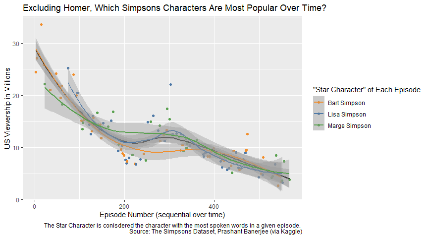
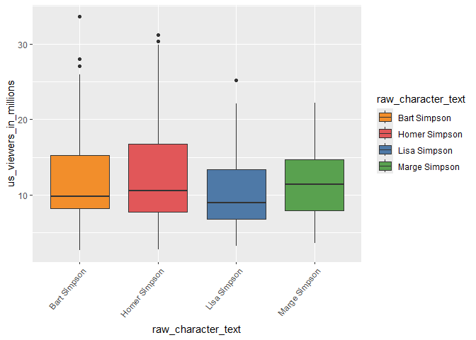
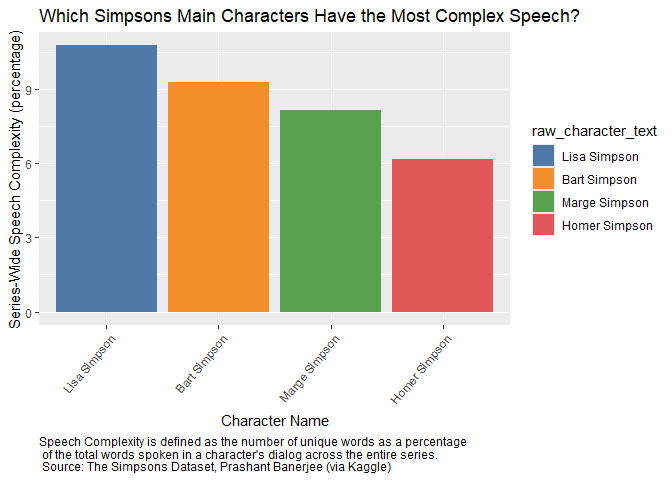

Final Report
================
Emery Lauer
2025-04-29

- [D’oh! Analyzing the Speech of The
  Simpsons](#doh-analyzing-the-speech-of-the-simpsons)
  - [Analyzing how popularity and complexity vary over
    time](#analyzing-how-popularity-and-complexity-vary-over-time)
  - [Background Information](#background-information)
  - [The Dataset](#the-dataset)
  - [Sources of Uncertainty in the
    Dataset](#sources-of-uncertainty-in-the-dataset)
  - [Guiding Question](#guiding-question)
  - [Sources of Uncertainty in our
    Methodology](#sources-of-uncertainty-in-our-methodology)
  - [Conclusions](#conclusions)

# D’oh! Analyzing the Speech of The Simpsons

### Analyzing how popularity and complexity vary over time

Data Science SP25 Final Project

Carter Harris, Swasti Jain, and Emery Lauer

## Background Information

*The Simpsons* is widely considered one of the most acclaimed and
successful TV series ever produced. Following the day-to-day life and
activities of the Simpson family, the animated sitcom chronicles and
satirizes American and western society, culture, and general family
dysfunction. The Simpson family - Homer, Marge, Bart, and Lisa - are far
from the only characters in this chronical, with an army of side
characters and celebrity “appearances” ranging from Albert Einstein to
Donald Trump. To this end, the show has garnered particular attention
for parodying current events and making zany predictions about the
future that sometimes end up coming true.

<figure>

<figcaption aria-hidden="true">The Simpsons family. From left to right:
Maggie, Marge, Lisa, Homer, and Bart.</figcaption>
</figure>

Having ran continuously for over 35 years, the show and the fictional
town of Springfield have become ubiquitous and universally-recognized
artifacts of modern media and popular culture. Beyond the entertainment
and comedic value, across three decades of production and writing teams,
the evolution of the show’s script, characters, plots, and settings
provides a rich window into the evolution and shifting of American
culture and family life as a whole. To this end, we wondered how the
script of The Simpsons has evolved through time and what it can tell us
about *The Simpsons’* viewers and the wider cultural influences of the
show.

## The Dataset

The dataset used for this analysis was originally compiled by the data
scientist and software engineer Todd Schneider for his article [“The
Simpsons by the
Data”](https://toddwschneider.com/posts/the-simpsons-by-the-data/)
posted to his website. This article served as a great starting place to
guide our research, alongside providing some important contextual
information to explain anomalies and strange trends in the data.

In this article, he links to a [GitHub
repository](https://github.com/toddwschneider/flim-springfield) that he
used for scraping this dataset. The code scrapes from several different
sources to compile the following information about *The Simpsons*
series:

- Primarily, the crawler scraped the “Simpsons’ World” website, which
  hosted all historical episodes of the show. From this source, the
  complete script for every episode, separated by character and
  individual line, was compiled. This represented a huge quantity of
  data across over 25 years of the show’s run, containing over 150,000
  lines. These script lines also provided a way to easily compile all
  characters in the show, ranging from the main characters in every
  episode to the one-off special appearances. This source also provided
  a way to compiled all locations in the show, although this data was
  not analyzed within this project.

- The second main source was [this Wikipedia
  article](https://en.wikipedia.org/wiki/List_of_The_Simpsons_episodes)
  which includes numerical data about every episode in the series. This
  source includes episode metadata (season, episode number, air date,
  etc). alongside original air date viewership data and ratings.

- Finally, the scraper also pulls data from
  [IMDb](https://www.imdb.com/title/tt0096697/episodes/), including
  ratings from IMDb’s voting system alongside supplemental episode
  information to that from Wikipedia.

Unfortunately, in late 2019, Disney (which acquired the rights to *The
Simpsons* in early 2019as part of its acquisition of 21st Century Fox)
moved all historical streaming episodes of *The Simpsons* from the
Simpsons’ World website to it’s Disney+ streaming subscription service.
As such, the original scraper no longer works for collecting the vast
array of data it previously provided. However, a user named [William
Cukierski](https://www.kaggle.com/wcukierski) on
[Kaggle](https://www.kaggle.com/), a website that hosts various data
science-related competitions, used the script to extract all episode
data through 2016. This dataset was further re-uploaded to the website
by user [Prashant Banerjee](https://www.kaggle.com/prashant111), which
is available here under the name [The Simpsons
Dataset](https://www.kaggle.com/datasets/prashant111/the-simpsons-dataset?resource=download).
An abbreviated version of this dataset was the February 24th, 2025
dataset for the weekly [Tidy Tuesday data science
project](https://github.com/rfordatascience/tidytuesday/tree/main/data/2025/2025-02-04),
which is where our team originally discovered it. However, to explore
the larger trends over time, all subsequent analysis was completed with
the complete 1989-2016 dataset available.

## Sources of Uncertainty in the Dataset

While the dataset offers a detailed look at The Simpsons’ episodes,
characters, and viewership over nearly three decades, there are several
sources of uncertainty that may affect the interpretation of the
<a href="%5Bdata:%5D(data:)%7B.uri%7D"
class="uri">[data:\\](data:){.uri}</a> As noted by Todd Schneider,
viewership data appears to spike around the year 2000, between seasons
11 and 12. This change is not due to a sudden increase in popularity but
rather a shift in the metric used. Wikipedia began reporting individual
viewers instead of households. This creates a discontinuity in the data
that may mislead trend analysis unless adjusted for or explicitly
acknowledged.  
Additionally, the dataset relies on scraping multiple sources, Simpsons
World, Wikipedia, and IMDb. There could be inconsistencies with these
sources. We know that Wikipedia data may be user-edited and not always
verified. However additionally IMDb ratings might reflect a
self-selected group of users and may not be representative of the
general audience.

## Guiding Question

How has the viewership of *The Simpsons* changed over time? Which
characters have been more or less popular at different points across the
show’s history?

#### Importing the data set into R

``` r
df_ep <- read.csv("data/simpsons_episodes.csv")
df_script <- read.csv("data/simpsons_script_lines.csv")

head(df_ep)
```

    ##   id
    ## 1  1
    ## 2  2
    ## 3  3
    ## 4  4
    ## 5  5
    ## 6  6
    ##                                                                              image_url
    ## 1         http://static-media.fxx.com/img/FX_Networks_-_FXX/617/479/Simpsons_01_08.jpg
    ## 2         http://static-media.fxx.com/img/FX_Networks_-_FXX/265/167/Simpsons_01_02.jpg
    ## 3         http://static-media.fxx.com/img/FX_Networks_-_FXX/621/883/Simpsons_01_03.jpg
    ## 4 http://static-media.fxx.com/img/FX_Networks_-_FXX/632/119/Simpsons_01_04__343617.jpg
    ## 5         http://static-media.fxx.com/img/FX_Networks_-_FXX/274/735/Simpsons_01_05.jpg
    ## 6         http://static-media.fxx.com/img/FX_Networks_-_FXX/631/642/Simpsons_01_06.jpg
    ##   imdb_rating imdb_votes number_in_season number_in_series original_air_date
    ## 1         8.2       3734                1                1        1989-12-17
    ## 2         7.8       1973                2                2        1990-01-14
    ## 3         7.5       1709                3                3        1990-01-21
    ## 4         7.8       1701                4                4        1990-01-28
    ## 5         8.1       1732                5                5        1990-02-04
    ## 6         7.6       1674                6                6        1990-02-11
    ##   original_air_year production_code season                             title
    ## 1              1989            7G08      1 Simpsons Roasting on an Open Fire
    ## 2              1990            7G02      1                   Bart the Genius
    ## 3              1990            7G03      1                   Homer's Odyssey
    ## 4              1990            7G04      1     There's No Disgrace Like Home
    ## 5              1990            7G05      1                  Bart the General
    ## 6              1990            7G06      1                      Moaning Lisa
    ##   us_viewers_in_millions                                       video_url  views
    ## 1                   26.7 http://www.simpsonsworld.com/video/273376835817 171408
    ## 2                   24.5 http://www.simpsonsworld.com/video/283744835990  91423
    ## 3                   27.5 http://www.simpsonsworld.com/video/273381443699  78072
    ## 4                   20.2 http://www.simpsonsworld.com/video/273392195780  67378
    ## 5                   27.1 http://www.simpsonsworld.com/video/300934723994  63129
    ## 6                   27.4 http://www.simpsonsworld.com/video/273391683535  55355

``` r
head(df_script)
```

    ##   id episode_id number
    ## 1  1          1      0
    ## 2  2          1      1
    ## 3  3          1      2
    ## 4  4          1      3
    ## 5  5          1      4
    ## 6  6          1      5
    ##                                                                                     raw_text
    ## 1                                               (Street: ext. street - establishing - night)
    ## 2                                                                    (Car: int. car - night)
    ## 3                                                        Marge Simpson: Ooo, careful, Homer.
    ## 4                                              Homer Simpson: There's no time to be careful.
    ## 5                                                                 Homer Simpson: We're late.
    ## 6 (Springfield Elementary School: Ext. springfield elementary school - establishing - night)
    ##   timestamp_in_ms speaking_line character_id location_id raw_character_text
    ## 1            8000         FALSE                        1                   
    ## 2            8000         FALSE                        2                   
    ## 3            8000          TRUE            1           2      Marge Simpson
    ## 4           10000          TRUE            2           2      Homer Simpson
    ## 5           10000          TRUE            2           2      Homer Simpson
    ## 6           24000         FALSE                        3                   
    ##               raw_location_text                   spoken_words
    ## 1                        Street                               
    ## 2                           Car                               
    ## 3                           Car           Ooo, careful, Homer.
    ## 4                           Car There's no time to be careful.
    ## 5                           Car                    We're late.
    ## 6 Springfield Elementary School                               
    ##                normalized_text word_count
    ## 1                                        
    ## 2                                        
    ## 3            ooo careful homer          3
    ## 4 theres no time to be careful          6
    ## 5                    were late          2
    ## 6

``` r
df_ep_new <- df_ep %>%
  select(id, imdb_votes, original_air_date, original_air_year, us_viewers_in_millions, views, season) %>%
  rename(
    episode_id = id
  )
```

#### Combining the two CSV files to get air dates, IMDB information, and words into the script information

``` r
get_word_counts_per_episode <- function(df_script) {
  df_script %>%
    filter(speaking_line == TRUE) %>%
    mutate(
      word_count = (as.numeric(word_count))
    ) %>%
    filter(!is.na(word_count)) %>%
    filter(word_count <= 1000) %>%
    group_by(episode_id, raw_character_text) %>%
    summarize(total_word_count = sum(word_count), .groups = "drop") %>%
    group_by(episode_id) %>%
    slice_max(total_word_count, n = 1, with_ties = FALSE) %>%
    arrange(episode_id, desc(total_word_count))
}

df_words_per_epsiode <-
  df_script %>%
  filter(speaking_line == TRUE) %>%
  mutate(word_count = as.numeric(word_count)) %>%
  filter(word_count <= 1000) %>%
  group_by(episode_id) %>%
  summarise(total_words_per_episode = sum(word_count)) %>%
  inner_join(df_ep_new, by = "episode_id")
```

    ## Warning: There was 1 warning in `mutate()`.
    ## ℹ In argument: `word_count = as.numeric(word_count)`.
    ## Caused by warning:
    ## ! NAs introduced by coercion

``` r
episode_word_counts <-
  get_word_counts_per_episode(df_script) %>%
  inner_join(df_words_per_epsiode, by = "episode_id") %>%
  select(
    c(
      "episode_id",
      "raw_character_text",
      "total_word_count",
      "total_words_per_episode"
    )
  ) %>%
  mutate(percentage_of_script = total_word_count / total_words_per_episode)
```

    ## Warning: There was 1 warning in `mutate()`.
    ## ℹ In argument: `word_count = (as.numeric(word_count))`.
    ## Caused by warning:
    ## ! NAs introduced by coercion

``` r
df_simpsons <- df_ep_new %>%
  left_join(episode_word_counts, by = "episode_id")

df_simpsons
```

    ##     episode_id imdb_votes original_air_date original_air_year
    ## 1            1       3734        1989-12-17              1989
    ## 2            2       1973        1990-01-14              1990
    ## 3            3       1709        1990-01-21              1990
    ## 4            4       1701        1990-01-28              1990
    ## 5            5       1732        1990-02-04              1990
    ## 6            6       1674        1990-02-11              1990
    ## 7            7       1638        1990-02-18              1990
    ## 8            8       1580        1990-02-25              1990
    ## 9            9       1578        1990-03-18              1990
    ## 10          10       1511        1990-03-25              1990
    ## 11          11       1539        1990-04-15              1990
    ## 12          12       1716        1990-04-29              1990
    ## 13          13       1567        1990-05-13              1990
    ## 14          14       1638        1990-10-11              1990
    ## 15          15       1588        1990-10-18              1990
    ## 16          16       1786        1990-10-25              1990
    ## 17          17       1457        1990-11-01              1990
    ## 18          18       1381        1990-11-08              1990
    ## 19          19       1366        1990-11-15              1990
    ## 20          20       1324        1990-11-22              1990
    ## 21          21       1522        1990-12-06              1990
    ## 22          22       1402        1990-12-20              1990
    ## 23          23       1340        1991-01-10              1991
    ## 24          24       1687        1991-01-24              1991
    ## 25          25       1392        1991-01-31              1991
    ## 26          26       1329        1991-02-07              1991
    ## 27          27       1241        1991-02-14              1991
    ## 28          28       1413        1991-02-21              1991
    ## 29          29       1264        1991-03-07              1991
    ## 30          30       1243        1991-03-28              1991
    ## 31          31       1257        1991-04-11              1991
    ## 32          32       1684        1991-04-25              1991
    ## 33          33       1246        1991-05-02              1991
    ## 34          34       1379        1991-05-09              1991
    ## 35          35       1223        1991-07-11              1991
    ## 36          36       1798        1991-09-19              1991
    ## 37          37       1274        1991-09-26              1991
    ## 38          38       1302        1991-10-03              1991
    ## 39          39       1446        1991-10-10              1991
    ## 40          40       1452        1991-10-17              1991
    ## 41          41       1262        1991-10-24              1991
    ## 42          42       1369        1991-10-31              1991
    ## 43          43       1243        1991-11-07              1991
    ## 44          44       1194        1991-11-14              1991
    ## 45          45       1618        1991-11-21              1991
    ## 46          46       1291        1991-12-05              1991
    ## 47          47       1213        1991-12-26              1991
    ## 48          48       1365        1992-01-09              1992
    ## 49          49       1179        1992-01-23              1992
    ## 50          50       1176        1992-02-06              1992
    ## 51          51       1272        1992-02-13              1992
    ## 52          52       1637        1992-02-20              1992
    ## 53          53       1201        1992-02-27              1992
    ## 54          54       1165        1992-03-12              1992
    ## 55          55       1233        1992-03-26              1992
    ## 56          56       1233        1992-04-09              1992
    ## 57          57       1176        1992-04-23              1992
    ## 58          58       1160        1992-05-07              1992
    ## 59          59       1227        1992-08-27              1992
    ## 60          60       1414        1992-09-24              1992
    ## 61          61       1339        1992-10-01              1992
    ## 62          62       1747        1992-10-08              1992
    ## 63          63       1194        1992-10-15              1992
    ## 64          64       1394        1992-10-29              1992
    ## 65          65       1293        1992-11-03              1992
    ## 66          66       1163        1992-11-05              1992
    ## 67          67       1240        1992-11-12              1992
    ## 68          68       1595        1992-11-19              1992
    ## 69          69       1350        1992-12-03              1992
    ## 70          70       1445        1992-12-17              1992
    ## 71          71       2028        1993-01-14              1993
    ## 72          72       1153        1993-01-21              1993
    ## 73          73       1176        1993-02-04              1993
    ## 74          74       1268        1993-02-11              1993
    ## 75          75       1209        1993-02-18              1993
    ## 76          76       1827        1993-03-11              1993
    ## 77          77       1105        1993-04-01              1993
    ## 78          78       1122        1993-04-15              1993
    ## 79          79       1234        1993-04-29              1993
    ## 80          80       1080        1993-05-06              1993
    ## 81          81       1269        1993-05-13              1993
    ## 82          82       1416        1993-09-30              1993
    ## 83          83       2010        1993-10-07              1993
    ## 84          84       1476        1993-10-14              1993
    ## 85          85       1479        1993-10-21              1993
    ## 86          86       1437        1993-10-28              1993
    ## 87          87       1132        1993-11-04              1993
    ## 88          88       1085        1993-11-11              1993
    ## 89          89       1270        1993-11-18              1993
    ## 90          90       1308        1993-12-09              1993
    ## 91          91       1274        1993-12-16              1993
    ## 92          92       1202        1994-01-06              1994
    ## 93          93       1123        1994-02-03              1994
    ## 94          94       1171        1994-02-10              1994
    ## 95          95       1187        1994-02-17              1994
    ## 96          96       1505        1994-02-24              1994
    ## 97          97       1191        1994-03-17              1994
    ## 98          98       1116        1994-03-31              1994
    ## 99          99       1143        1994-04-14              1994
    ## 100        100       1118        1994-04-28              1994
    ## 101        101       1103        1994-05-05              1994
    ## 102        102       1014        1994-05-12              1994
    ## 103        103       1060        1994-05-19              1994
    ## 104        104       1330        1994-09-04              1994
    ## 105        105       1156        1994-09-11              1994
    ## 106        106       1051        1994-09-25              1994
    ## 107        107       1277        1994-10-02              1994
    ## 108        108       1142        1994-10-09              1994
    ## 109        109       1690        1994-10-30              1994
    ## 110        110       1150        1994-11-06              1994
    ## 111        111       1236        1994-11-13              1994
    ## 112        112       1655        1994-11-27              1994
    ## 113        113       1060        1994-12-04              1994
    ## 114        114       1100        1994-12-18              1994
    ## 115        115       1457        1995-01-08              1995
    ## 116        116       1284        1995-01-22              1995
    ## 117        117       1221        1995-02-05              1995
    ## 118        118       1254        1995-02-12              1995
    ## 119        119       1353        1995-02-19              1995
    ## 120        120       1006        1995-02-26              1995
    ## 121        121       1223        1995-03-05              1995
    ## 122        122       1190        1995-03-19              1995
    ## 123        123       1051        1995-04-09              1995
    ## 124        124       1004        1995-04-16              1995
    ## 125        125       1084        1995-04-30              1995
    ## 126        126       1003        1995-05-07              1995
    ## 127        127       1285        1995-05-14              1995
    ## 128        128       1619        1995-05-21              1995
    ## 129        129       1497        1995-09-17              1995
    ## 130        130       1172        1995-09-24              1995
    ## 131        131       1088        1995-10-01              1995
    ## 132        132       1354        1995-10-08              1995
    ## 133        133       1288        1995-10-15              1995
    ## 134        134       1304        1995-10-29              1995
    ## 135        135       1633        1995-11-05              1995
    ## 136        136       1226        1995-11-19              1995
    ## 137        137       1023        1995-11-26              1995
    ## 138        138       1038        1995-12-03              1995
    ## 139        139       1146        1995-12-17              1995
    ## 140        140       1064        1996-01-07              1996
    ## 141        141       1264        1996-01-14              1996
    ## 142        142        962        1996-02-04              1996
    ## 143        143        954        1996-02-11              1996
    ## 144        144       1039        1996-02-18              1996
    ## 145        145       1609        1996-02-25              1996
    ## 146        146       1016        1996-03-17              1996
    ## 147        147       1103        1996-03-24              1996
    ## 148        148       1110        1996-03-31              1996
    ## 149        149       1393        1996-04-14              1996
    ## 150        150       1122        1996-04-28              1996
    ## 151        151        995        1996-05-05              1996
    ## 152        152       1095        1996-05-19              1996
    ## 153        153       1119        1996-05-19              1996
    ## 154        154       1186        1996-10-27              1996
    ## 155        155       2439        1996-11-03              1996
    ## 156        156       1085        1996-11-10              1996
    ## 157        157       1079        1996-11-17              1996
    ## 158        158       1098        1996-11-24              1996
    ## 159        159       1008        1996-12-01              1996
    ## 160        160       1005        1996-12-15              1996
    ## 161        161       1268        1996-12-29              1996
    ## 162        162       1383        1997-01-05              1997
    ## 163        163       1793        1997-01-12              1997
    ## 164        164        998        1997-01-19              1997
    ## 165        165       1137        1997-02-02              1997
    ## 166        166       1088        1997-02-07              1997
    ## 167        167       1079        1997-02-09              1997
    ## 168        168       1666        1997-02-16              1997
    ## 169        169       1100        1997-02-23              1997
    ## 170        170       1020        1997-03-02              1997
    ## 171        171       1330        1997-03-16              1997
    ## 172        172        995        1997-04-06              1997
    ## 173        173        913        1997-04-13              1997
    ## 174        174        967        1997-04-20              1997
    ## 175        175        973        1997-04-27              1997
    ## 176        176       2256        1997-05-04              1997
    ## 177        177       1006        1997-05-11              1997
    ## 178        178        967        1997-05-18              1997
    ## 179        179       1918        1997-09-21              1997
    ## 180        180       1158        1997-09-28              1997
    ## 181        181        980        1997-10-19              1997
    ## 182        182       1019        1997-10-26              1997
    ## 183        183       1081        1997-11-02              1997
    ## 184        184        925        1997-11-09              1997
    ## 185        185        905        1997-11-16              1997
    ## 186        186        978        1997-11-23              1997
    ## 187        187        888        1997-12-07              1997
    ## 188        188        958        1997-12-21              1997
    ## 189        189       1119        1998-01-04              1998
    ## 190        190        938        1998-01-11              1998
    ## 191        191       1042        1998-02-08              1998
    ## 192        192       1036        1998-02-15              1998
    ## 193        193        878        1998-02-22              1998
    ## 194        194        887        1998-03-01              1998
    ## 195        195        957        1998-03-08              1998
    ## 196        196        906        1998-03-22              1998
    ## 197        197       1026        1998-03-29              1998
    ## 198        198        949        1998-04-05              1998
    ## 199        199        905        1998-04-19              1998
    ## 200        200       1108        1998-04-26              1998
    ## 201        201        962        1998-05-03              1998
    ## 202        202        880        1998-05-10              1998
    ## 203        203        931        1998-05-17              1998
    ## 204        204        932        1998-08-23              1998
    ## 205        205        988        1998-09-20              1998
    ## 206        206        899        1998-09-27              1998
    ## 207        207       1013        1998-10-25              1998
    ## 208        208        934        1998-11-08              1998
    ## 209        209        901        1998-11-15              1998
    ## 210        210        909        1998-11-22              1998
    ## 211        211        863        1998-12-06              1998
    ## 212        212        975        1998-12-20              1998
    ## 213        213        928        1999-01-10              1999
    ## 214        214        834        1999-01-17              1999
    ## 215        215        880        1999-01-31              1999
    ## 216        216        882        1999-02-07              1999
    ## 217        217        815        1999-02-14              1999
    ## 218        218        831        1999-02-21              1999
    ## 219        219        795        1999-02-28              1999
    ## 220        220        843        1999-03-28              1999
    ## 221        221        851        1999-04-04              1999
    ## 222        222        831        1999-04-11              1999
    ## 223        223        779        1999-04-25              1999
    ## 224        224        789        1999-05-02              1999
    ## 225        225        804        1999-05-09              1999
    ## 226        226        964        1999-05-16              1999
    ## 227        227        917        1999-09-26              1999
    ## 228        228        776        1999-10-03              1999
    ## 229        229        797        1999-10-24              1999
    ## 230        230        876        1999-10-31              1999
    ## 231        231        817        1999-11-07              1999
    ## 232        232        759        1999-11-14              1999
    ## 233        233        747        1999-11-21              1999
    ## 234        234        775        1999-11-28              1999
    ## 235        235        809        1999-12-19              1999
    ## 236        236        715        2000-01-09              2000
    ## 237        237        734        2000-01-16              2000
    ## 238        238        747        2000-01-23              2000
    ## 239        239        822        2000-02-06              2000
    ## 240        240        887        2000-02-13              2000
    ## 241        241        777        2000-02-20              2000
    ## 242        242        755        2000-02-27              2000
    ## 243        243        780        2000-03-19              2000
    ## 244        244        724        2000-04-09              2000
    ## 245        245        805        2000-04-30              2000
    ## 246        246        716        2000-05-07              2000
    ## 247        247        737        2000-05-14              2000
    ## 248        248        955        2000-05-21              2000
    ## 249        249        829        2000-11-01              2000
    ## 250        250        803        2000-11-05              2000
    ## 251        251        733        2000-11-12              2000
    ## 252        252        731        2000-11-19              2000
    ## 253        253        762        2000-11-26              2000
    ## 254        254        782        2000-12-03              2000
    ## 255        255        766        2000-12-10              2000
    ## 256        256        836        2000-12-17              2000
    ## 257        257        899        2001-01-07              2001
    ## 258        258        760        2001-01-14              2001
    ## 259        259        761        2001-02-04              2001
    ## 260        260        730        2001-02-11              2001
    ## 261        261        668        2001-02-18              2001
    ## 262        262        833        2001-02-25              2001
    ## 263        263        731        2001-03-04              2001
    ## 264        264        691        2001-03-11              2001
    ## 265        265        719        2001-04-01              2001
    ## 266        266       1095        2001-04-29              2001
    ## 267        267        721        2001-05-06              2001
    ## 268        268        666        2001-05-13              2001
    ## 269        269        688        2001-05-20              2001
    ## 270        270        824        2001-11-06              2001
    ## 271        271        674        2001-11-11              2001
    ## 272        272        698        2001-11-18              2001
    ## 273        273        651        2001-12-02              2001
    ## 274        274        716        2001-12-09              2001
    ## 275        275        692        2001-12-16              2001
    ## 276        276        649        2002-01-06              2002
    ## 277        277        649        2002-01-20              2002
    ## 278        278        642        2002-01-27              2002
    ## 279        279        683        2002-02-10              2002
    ## 280        280        621        2002-02-17              2002
    ## 281        281        656        2002-02-24              2002
    ## 282        282        623        2002-03-10              2002
    ## 283        283        630        2002-03-17              2002
    ## 284        284        670        2002-03-31              2002
    ## 285        285        765        2002-04-07              2002
    ## 286        286        721        2002-04-21              2002
    ## 287        287        704        2002-04-28              2002
    ## 288        288        598        2002-05-05              2002
    ## 289        289        613        2002-05-12              2002
    ## 290        290        642        2002-05-19              2002
    ## 291        291        701        2002-05-22              2002
    ## 292        292        752        2002-11-03              2002
    ## 293        293        713        2002-11-10              2002
    ## 294        294        645        2002-11-17              2002
    ## 295        295        704        2002-11-24              2002
    ## 296        296        633        2002-12-01              2002
    ## 297        297        628        2002-12-15              2002
    ## 298        298        593        2003-01-05              2003
    ## 299        299        598        2003-01-12              2003
    ## 300        300        644        2003-02-02              2003
    ## 301        301        598        2003-02-09              2003
    ## 302        302        650        2003-02-16              2003
    ## 303        303        628        2003-02-16              2003
    ## 304        304        599        2003-03-02              2003
    ## 305        305        577        2003-03-09              2003
    ## 306        306        557        2003-03-16              2003
    ## 307        307        555        2003-03-30              2003
    ## 308        308        649        2003-04-13              2003
    ## 309        309        651        2003-04-27              2003
    ## 310        310        574        2003-05-04              2003
    ## 311        311        570        2003-05-11              2003
    ## 312        312        575        2003-05-18              2003
    ## 313        313        697        2003-05-18              2003
    ## 314        314        738        2003-11-02              2003
    ## 315        315        595        2003-11-09              2003
    ## 316        316        631        2003-11-16              2003
    ## 317        317        705        2003-11-23              2003
    ## 318        318        586        2003-11-30              2003
    ## 319        319        576        2003-12-07              2003
    ## 320        320        588        2003-12-14              2003
    ## 321        321        589        2004-01-04              2004
    ## 322        322        607        2004-01-11              2004
    ## 323        323        596        2004-01-25              2004
    ## 324        324        575        2004-02-08              2004
    ## 325        325        583        2004-02-15              2004
    ## 326        326        589        2004-02-22              2004
    ## 327        327        568        2004-03-14              2004
    ## 328        328        560        2004-03-21              2004
    ## 329        329        599        2004-03-28              2004
    ## 330        330        560        2004-04-18              2004
    ## 331        331        609        2004-04-25              2004
    ## 332        332        600        2004-05-02              2004
    ## 333        333        587        2004-05-09              2004
    ## 334        334        593        2004-05-16              2004
    ## 335        335        553        2004-05-23              2004
    ## 336        336        666        2004-11-07              2004
    ## 337        337        566        2004-11-14              2004
    ## 338        338        556        2004-11-21              2004
    ## 339        339        562        2004-12-05              2004
    ## 340        340        539        2004-12-12              2004
    ## 341        341        554        2005-01-16              2005
    ## 342        342        523        2005-01-30              2005
    ## 343        343        582        2005-02-06              2005
    ## 344        344        607        2005-02-13              2005
    ## 345        345        580        2005-02-20              2005
    ## 346        346        572        2005-03-06              2005
    ## 347        347        586        2005-03-13              2005
    ## 348        348        530        2005-03-20              2005
    ## 349        349        535        2005-04-03              2005
    ## 350        350        615        2005-04-17              2005
    ## 351        351        661        2005-05-01              2005
    ## 352        352        562        2005-05-01              2005
    ## 353        353        554        2005-05-08              2005
    ## 354        354        575        2005-05-08              2005
    ## 355        355        546        2005-05-15              2005
    ## 356        356        635        2005-05-15              2005
    ## 357        357        618        2005-09-11              2005
    ## 358        358        585        2005-09-18              2005
    ## 359        359        558        2005-09-25              2005
    ## 360        360        646        2005-11-06              2005
    ## 361        361        578        2005-11-13              2005
    ## 362        362        543        2005-11-20              2005
    ## 363        363        560        2005-11-27              2005
    ## 364        364        706        2005-12-11              2005
    ## 365        365        553        2005-12-18              2005
    ## 366        366        554        2006-01-08              2006
    ## 367        367        535        2006-01-29              2006
    ## 368        368        597        2006-02-26              2006
    ## 369        369        642        2006-03-12              2006
    ## 370        370        558        2006-03-19              2006
    ## 371        371        854        2006-03-26              2006
    ## 372        372        577        2006-04-02              2006
    ## 373        373        677        2006-04-09              2006
    ## 374        374        549        2006-04-23              2006
    ## 375        375        582        2006-04-30              2006
    ## 376        376        558        2006-05-07              2006
    ## 377        377        596        2006-05-14              2006
    ## 378        378        587        2006-05-21              2006
    ## 379        379        754        2006-09-10              2006
    ## 380        380        671        2006-09-17              2006
    ## 381        381        623        2006-09-24              2006
    ## 382        382        723        2006-11-05              2006
    ## 383        383        656        2006-11-12              2006
    ## 384        384        605        2006-11-19              2006
    ## 385        385        603        2006-11-26              2006
    ## 386        386        578        2006-12-10              2006
    ## 387        387        624        2006-12-17              2006
    ## 388        388        615        2007-01-07              2007
    ## 389        389        580        2007-01-28              2007
    ## 390        390        672        2007-02-11              2007
    ## 391        391        617        2007-02-18              2007
    ## 392        392        644        2007-03-04              2007
    ## 393        393        606        2007-03-11              2007
    ## 394        394        610        2007-03-25              2007
    ## 395        395        678        2007-04-22              2007
    ## 396        396        585        2007-04-29              2007
    ## 397        397        542        2007-05-06              2007
    ## 398        398        569        2007-05-13              2007
    ## 399        399       1179        2007-05-20              2007
    ## 400        400        692        2007-05-20              2007
    ## 401        401        706        2007-09-23              2007
    ## 402        402        684        2007-09-30              2007
    ## 403        403        637        2007-10-07              2007
    ## 404        404        620        2007-10-14              2007
    ## 405        405        687        2007-11-04              2007
    ## 406        406        591        2007-11-11              2007
    ## 407        407        762        2007-11-18              2007
    ## 408        408        673        2007-11-25              2007
    ## 409        409        949        2007-12-16              2007
    ## 410        410        633        2008-01-06              2008
    ## 411        411       1069        2008-01-27              2008
    ## 412        412        636        2008-02-17              2008
    ## 413        413        788        2008-03-02              2008
    ## 414        414        626        2008-03-09              2008
    ## 415        415        580        2008-03-30              2008
    ## 416        416        585        2008-04-13              2008
    ## 417        417        601        2008-04-27              2008
    ## 418        418        585        2008-05-04              2008
    ## 419        419        613        2008-05-11              2008
    ## 420        420        538        2008-05-18              2008
    ## 421        421        780        2008-09-28              2008
    ## 422        422        681        2008-10-05              2008
    ## 423        423        638        2008-10-19              2008
    ## 424        424        757        2008-11-02              2008
    ## 425        425        615        2008-11-09              2008
    ## 426        426        599        2008-11-16              2008
    ## 427        427        728        2008-11-30              2008
    ## 428        428        615        2008-12-07              2008
    ## 429        429        706        2009-01-25              2009
    ## 430        430        591        2009-02-15              2009
    ## 431        431        603        2009-03-01              2009
    ## 432        432        582        2009-03-08              2009
    ## 433        433        652        2009-03-15              2009
    ## 434        434        619        2009-03-22              2009
    ## 435        435        571        2009-03-29              2009
    ## 436        436        604        2009-04-05              2009
    ## 437        437        605        2009-04-19              2009
    ## 438        438        554        2009-04-26              2009
    ## 439        439        613        2009-05-03              2009
    ## 440        440        591        2009-05-10              2009
    ## 441        441        648        2009-05-17              2009
    ## 442        442        698        2009-09-27              2009
    ## 443        443        585        2009-10-04              2009
    ## 444        444        562        2009-10-11              2009
    ## 445        445        671        2009-10-18              2009
    ## 446        446        560        2009-11-15              2009
    ## 447        447        543        2009-11-22              2009
    ## 448        448        529        2009-11-29              2009
    ## 449        449        542        2009-12-13              2009
    ## 450        450        481        2010-01-03              2010
    ## 451        451        552        2010-01-10              2010
    ## 452        452        532        2010-01-31              2010
    ## 453        453        525        2010-02-14              2010
    ## 454        454        496        2010-02-21              2010
    ## 455        455        480        2010-03-14              2010
    ## 456        456        554        2010-03-21              2010
    ## 457        457        675        2010-03-28              2010
    ## 458        458        482        2010-04-11              2010
    ## 459        459        482        2010-04-18              2010
    ## 460        460        511        2010-04-25              2010
    ## 461        461        519        2010-05-02              2010
    ## 462        462        491        2010-05-09              2010
    ## 463        463        545        2010-05-16              2010
    ## 464        464        507        2010-05-23              2010
    ## 465        465        691        2010-09-26              2010
    ## 466        466        506        2010-10-03              2010
    ## 467        467        501        2010-10-10              2010
    ## 468        468        680        2010-11-07              2010
    ## 469        469        482        2010-11-14              2010
    ## 470        470        479        2010-11-21              2010
    ## 471        471        489        2010-11-28              2010
    ## 472        472        564        2010-12-05              2010
    ## 473        473        528        2010-12-12              2010
    ## 474        474        464        2011-01-09              2011
    ## 475        475        520        2011-01-16              2011
    ## 476        476        486        2011-01-23              2011
    ## 477        477        461        2011-02-13              2011
    ## 478        478        559        2011-02-20              2011
    ## 479        479        489        2011-03-06              2011
    ## 480        480        481        2011-03-13              2011
    ## 481        481        470        2011-03-27              2011
    ## 482        482        491        2011-04-10              2011
    ## 483        483        486        2011-05-01              2011
    ## 484        484        483        2011-05-08              2011
    ## 485        485        505        2011-05-15              2011
    ## 486        486        492        2011-05-22              2011
    ## 487        487        672        2011-09-25              2011
    ## 488        488        528        2011-10-02              2011
    ## 489        489        654        2011-10-30              2011
    ## 490        490        491        2011-11-06              2011
    ## 491        491        562        2011-11-13              2011
    ## 492        492        712        2011-11-20              2011
    ## 493        493        493        2011-11-27              2011
    ## 494        494        476        2011-12-04              2011
    ## 495        495        905        2011-12-11              2011
    ## 496        496        549        2012-01-08              2012
    ## 497        497        553        2012-01-15              2012
    ## 498        498        562        2012-01-29              2012
    ## 499        499        490        2012-02-12              2012
    ## 500        500        580        2012-02-19              2012
    ## 501        501        425        2012-03-04              2012
    ## 502        502        541        2012-03-11              2012
    ## 503        503        493        2012-03-18              2012
    ## 504        504        470        2012-04-15              2012
    ## 505        505        568        2012-04-29              2012
    ## 506        506        405        2012-05-06              2012
    ## 507        507        408        2012-05-13              2012
    ## 508        508       1215        2012-05-20              2012
    ## 509        509        597        2012-09-30              2012
    ## 510        510        600        2012-10-07              2012
    ## 511        511        460        2012-11-04              2012
    ## 512        512        415        2012-11-11              2012
    ## 513        513        426        2012-11-18              2012
    ## 514        514        430        2012-11-25              2012
    ## 515        515        493        2012-12-09              2012
    ## 516        516        441        2012-12-16              2012
    ## 517        517        411        2013-01-06              2013
    ## 518        518        408        2013-01-13              2013
    ## 519        519        405        2013-01-27              2013
    ## 520        520        471        2013-02-10              2013
    ## 521        521        406        2013-02-17              2013
    ## 522        522        423        2013-03-03              2013
    ## 523        523        418        2013-03-10              2013
    ## 524        524        417        2013-03-17              2013
    ## 525        525        425        2013-04-14              2013
    ## 526        526        405        2013-04-28              2013
    ## 527        527        371        2013-05-05              2013
    ## 528        528        410        2013-05-12              2013
    ## 529        529        460        2013-05-19              2013
    ## 530        530        396        2013-05-19              2013
    ## 531        531        635        2013-09-29              2013
    ## 532        532        654        2013-10-06              2013
    ## 533        533        482        2013-11-03              2013
    ## 534        534        489        2013-11-10              2013
    ## 535        535        442        2013-11-17              2013
    ## 536        536        468        2013-11-24              2013
    ## 537        537        440        2013-12-08              2013
    ## 538        538        449        2013-12-15              2013
    ## 539        539        648        2014-01-05              2014
    ## 540        540        475        2014-01-12              2014
    ## 541        541        431        2014-01-26              2014
    ## 542        542        473        2014-03-09              2014
    ## 543        543        468        2014-03-09              2014
    ## 544        544        407        2014-03-16              2014
    ## 545        545        414        2014-03-23              2014
    ## 546        546        430        2014-03-30              2014
    ## 547        547        415        2014-04-06              2014
    ## 548        548        504        2014-04-13              2014
    ## 549        549        445        2014-04-27              2014
    ## 550        550        705        2014-05-04              2014
    ## 551        551        402        2014-05-11              2014
    ## 552        552        416        2014-05-18              2014
    ## 553        553        652        2014-09-28              2014
    ## 554        554        490        2014-10-05              2014
    ## 555        555        457        2014-10-12              2014
    ## 556        556        612        2014-10-19              2014
    ## 557        557        442        2014-11-02              2014
    ## 558        558        977        2014-11-09              2014
    ## 559        559        456        2014-11-16              2014
    ## 560        560        431        2014-11-23              2014
    ## 561        561        432        2014-12-07              2014
    ## 562        562        578        2015-01-04              2015
    ## 563        563        434        2015-01-11              2015
    ## 564        564        439        2015-01-25              2015
    ## 565        565        377        2015-02-08              2015
    ## 566        566        360        2015-02-15              2015
    ## 567        567        372        2015-03-01              2015
    ## 568        568        377        2015-03-08              2015
    ## 569        569        374        2015-03-15              2015
    ## 570        570        334        2015-04-19              2015
    ## 571        571        347        2015-04-26              2015
    ## 572        572        330        2015-05-03              2015
    ## 573        573        335        2015-05-10              2015
    ## 574        574        335        2015-05-17              2015
    ## 575        575        532        2015-09-27              2015
    ## 576        576        395        2015-10-04              2015
    ## 577        577        404        2015-10-11              2015
    ## 578        578        462        2015-10-18              2015
    ## 579        579        385        2015-10-25              2015
    ## 580        580        335        2015-11-08              2015
    ## 581        581        328        2015-11-22              2015
    ## 582        582        305        2015-12-06              2015
    ## 583        583        698        2015-12-13              2015
    ## 584        584        356        2016-01-03              2016
    ## 585        585        309        2016-01-10              2016
    ## 586        586        271        2016-01-17              2016
    ## 587        587        252        2016-02-14              2016
    ## 588        588        293        2016-02-21              2016
    ## 589        589        233        2016-03-06              2016
    ## 590        590        262        2016-03-13              2016
    ## 591        591        246        2016-04-03              2016
    ## 592        592        228        2016-04-10              2016
    ## 593        593        229        2016-04-24              2016
    ## 594        594        193        2016-05-08              2016
    ## 595        595        227        2016-05-15              2016
    ## 596        596        210        2016-05-22              2016
    ## 597        597        104        2016-09-25              2016
    ## 598        598         NA        2016-10-02              2016
    ## 599        599         NA        2016-10-09              2016
    ## 600        600         NA        2016-10-16              2016
    ##     us_viewers_in_millions  views season       raw_character_text
    ## 1                    26.70 171408      1            Homer Simpson
    ## 2                    24.50  91423      1             Bart Simpson
    ## 3                    27.50  78072      1            Homer Simpson
    ## 4                    20.20  67378      1            Homer Simpson
    ## 5                    27.10  63129      1             Bart Simpson
    ## 6                    27.40  55355      1            Homer Simpson
    ## 7                    27.60  57793      1            Homer Simpson
    ## 8                    28.00  66311      1             Bart Simpson
    ## 9                    33.50  64776      1                  Jacques
    ## 10                   30.30  50816      1            Homer Simpson
    ## 11                   31.20  60458      1            Homer Simpson
    ## 12                   30.40  62561      1             Sideshow Bob
    ## 13                   27.10  57590      1            Homer Simpson
    ## 14                   33.60  59575      2             Bart Simpson
    ## 15                   29.90  58553      2            Homer Simpson
    ## 16                   27.40 130282      2            Homer Simpson
    ## 17                   26.10  64959      2      C. Montgomery Burns
    ## 18                   26.10  49005      2            Homer Simpson
    ## 19                   25.40  50691      2            Homer Simpson
    ## 20                   25.90  47539      2             Bart Simpson
    ## 21                   26.20  57605      2            Homer Simpson
    ## 22                   22.20  55413      2            Marge Simpson
    ## 23                   24.80  56486      2            Homer Simpson
    ## 24                   24.20  50206      2            Homer Simpson
    ## 25                   26.80  51182      2            Homer Simpson
    ## 26                   26.20  58277      2            Homer Simpson
    ## 27                   23.90  46823      2          Seymour Skinner
    ## 28                   26.80  47426      2            Homer Simpson
    ## 29                   23.90  47780      2            Homer Simpson
    ## 30                   21.20  44331      2           Grampa Simpson
    ## 31                   20.60  58561      2            Homer Simpson
    ## 32                   17.70  52770      2                BERGSTROM
    ## 33                   19.70  51997      2            Homer Simpson
    ## 34                   21.00  50403      2             Bart Simpson
    ## 35                   17.30  52829      2            Homer Simpson
    ## 36                   22.90  55238      3            Homer Simpson
    ## 37                   20.20  52098      3            Homer Simpson
    ## 38                   22.80  53499      3            Homer Simpson
    ## 39                   20.80  64342      3                 Fat Tony
    ## 40                   20.60  50601      3      C. Montgomery Burns
    ## 41                   20.20  45586      3         Krusty the Clown
    ## 42                   20.00 103012      3            Homer Simpson
    ## 43                   23.00  53093      3            Homer Simpson
    ## 44                   24.70  55808      3            Homer Simpson
    ## 45                   23.90  58968      3              Moe Szyslak
    ## 46                   21.10  55987      3      C. Montgomery Burns
    ## 47                   21.90  47880      3            Homer Simpson
    ## 48                   24.20  58919      3             Bart Simpson
    ## 49                   23.20  49457      3            Homer Simpson
    ## 50                   23.70  58991      3            Homer Simpson
    ## 51                   20.50  53123      3            Homer Simpson
    ## 52                   24.60  72378      3      C. Montgomery Burns
    ## 53                   23.70  61508      3          Seymour Skinner
    ## 54                   23.40  49665      3            Homer Simpson
    ## 55                   25.50  46901      3            Homer Simpson
    ## 56                   17.30  57582      3             Sideshow Bob
    ## 57                   17.50  50068      3                Otto Mann
    ## 58                   19.50  48058      3             Bart Simpson
    ## 59                   17.20  50936      3                     HERB
    ## 60                   21.80  67081      4             Bart Simpson
    ## 61                   18.30  54487      4            Marge Simpson
    ## 62                   19.30  64605      4            Homer Simpson
    ## 63                   19.00  52203      4            Homer Simpson
    ## 64                   25.10 108171      4      C. Montgomery Burns
    ## 65                   20.10  55740      4            Homer Simpson
    ## 66                   22.90  69527      4            Homer Simpson
    ## 67                   23.10  54557      4            Homer Simpson
    ## 68                   24.00  63564      4            Homer Simpson
    ## 69                   28.60  62070      4            Homer Simpson
    ## 70                   23.60  57400      4            Homer Simpson
    ## 71                   23.00  88171      4                   LANLEY
    ## 72                   24.50  56396      4            Selma Bouvier
    ## 73                   23.80  59040      4            Homer Simpson
    ## 74                   25.20  62309      4             Lisa Simpson
    ## 75                   25.70  84874      4            Homer Simpson
    ## 76                   22.40  71907      4      C. Montgomery Burns
    ## 77                   25.50  49139      4            Homer Simpson
    ## 78                   20.10  53404      4           Grampa Simpson
    ## 79                   20.00  60739      4          Seymour Skinner
    ## 80                   17.30  68692      4              Lionel Hutz
    ## 81                   19.40  59948      4         Krusty the Clown
    ## 82                   19.90  58390      5            Homer Simpson
    ## 83                   20.00  65585      5             Sideshow Bob
    ## 84                   18.10  64802      5            Homer Simpson
    ## 85                   19.50  57149      5            Homer Simpson
    ## 86                   24.00 110251      5             Bart Simpson
    ## 87                   21.70  53490      5            Homer Simpson
    ## 88                   18.70  74139      5                  GOODMAN
    ## 89                   20.10  83238      5            Homer Simpson
    ## 90                   20.60  59350      5            Homer Simpson
    ## 91                   17.90  82216      5            Homer Simpson
    ## 92                   20.10  74673      5            Homer Simpson
    ## 93                   20.00  66267      5             Bart Simpson
    ## 94                   21.80  58716      5   Apu Nahasapeemapetilon
    ## 95                   20.50  61715      5             Lisa Simpson
    ## 96                   18.20  75439      5            Homer Simpson
    ## 97                   18.00  69996      5            Homer Simpson
    ## 98                   17.00  63427      5            Homer Simpson
    ## 99                   14.70  81678      5      C. Montgomery Burns
    ## 100                  19.70  66406      5          Seymour Skinner
    ## 101                  15.50  74427      5          Seymour Skinner
    ## 102                  15.10  59503      5           Grampa Simpson
    ## 103                  15.60  67959      5            Homer Simpson
    ## 104                  15.10  65126      6             Bart Simpson
    ## 105                  16.70  54225      6             Lisa Simpson
    ## 106                  13.50  42576      6            Marge Simpson
    ## 107                  14.80  72722      6            Marge Simpson
    ## 108                  14.40  76932      6             Sideshow Bob
    ## 109                  22.20 119295      6            Homer Simpson
    ## 110                  15.30  62450      6             Bart Simpson
    ## 111                  17.90  63564      6            Homer Simpson
    ## 112                  17.00  71577      6            Homer Simpson
    ## 113                  14.10  64719      6            Homer Simpson
    ## 114                  15.60  61569      6            Homer Simpson
    ## 115                  20.10  71002      6            Homer Simpson
    ## 116                  17.30  63051      6            Homer Simpson
    ## 117                  18.70  67619      6          Seymour Skinner
    ## 118                  17.60  73123      6            Homer Simpson
    ## 119                  15.10  80724      6             Bart Simpson
    ## 120                  18.90  60599      6            Homer Simpson
    ## 121                  14.40  71936      6            Homer Simpson
    ## 122                  14.40  74266      6             Lisa Simpson
    ## 123                  11.60  62323      6      C. Montgomery Burns
    ## 124                  11.80  74788      6          Seymour Skinner
    ## 125                  12.60  56001      6             Lisa Simpson
    ## 126                  12.70  79777      6            Homer Simpson
    ## 127                  13.10  70698      6             Bart Simpson
    ## 128                  15.00  86070      6      C. Montgomery Burns
    ## 129                  16.00  67579      7             Lisa Simpson
    ## 130                  15.70  62390      7             Bart Simpson
    ## 131                  14.50  70120      7            Marge Simpson
    ## 132                  14.80  65333      7             Bart Simpson
    ## 133                  14.60  69245      7             Lisa Simpson
    ## 134                  19.70 110342      7            Homer Simpson
    ## 135                  17.00  81426      7            Homer Simpson
    ## 136                  15.30  61085      7            Homer Simpson
    ## 137                  14.20  61246      7             Sideshow Bob
    ## 138                  16.40  56153      7             Troy McClure
    ## 139                  16.70  68970      7            Marge Simpson
    ## 140                  16.70  72268      7            Homer Simpson
    ## 141                  16.50  64224      7         George H.W. Bush
    ## 142                  14.40  58572      7            Marge Simpson
    ## 143                  15.00  71230      7         Krusty the Clown
    ## 144                  13.40  58795      7             Lisa Simpson
    ## 145                  14.10  68354      7      C. Montgomery Burns
    ## 146                  14.40  57809      7             Bart Simpson
    ## 147                  12.90  57830      7                     TROY
    ## 148                  11.80  70913      7             Bart Simpson
    ## 149                  10.50  66536      7          Seymour Skinner
    ## 150                  13.00  69120      7           Grampa Simpson
    ## 151                  11.30  75618      7   Apu Nahasapeemapetilon
    ## 152                  12.90  60569      7            Homer Simpson
    ## 153                  14.70  65847      7             Lisa Simpson
    ## 154                  18.30 102077      8            Homer Simpson
    ## 155                  13.90  79609      8             Hank Scorpio
    ## 156                  17.00  61146      8              Moe Szyslak
    ## 157                  12.60  55497      8                    Larry
    ## 158                  14.10  60210      8            Homer Simpson
    ## 159                  12.80  60956      8            Homer Simpson
    ## 160                     NA  60912      8             Lisa Simpson
    ## 161                     NA  66281      8             Ned Flanders
    ## 162                  14.90  64743      8            Homer Simpson
    ## 163                  20.90  69555      8            Homer Simpson
    ## 164                  14.00  71813      8            Marge Simpson
    ## 165                   9.10  60763      8      C. Montgomery Burns
    ## 166                  17.70  57608      8            Homer Simpson
    ## 167                  15.50  58581      8            Homer Simpson
    ## 168                  15.30  63355      8            Homer Simpson
    ## 169                  15.10  56659      8             Sideshow Bob
    ## 170                  15.10  54247      8             Lisa Simpson
    ## 171                  14.60  83561      8            Homer Simpson
    ## 172                  13.30  60584      8          Seymour Skinner
    ## 173                     NA  54155      8             Bart Simpson
    ## 174                  14.00  56833      8      C. Montgomery Burns
    ## 175                  16.90  59088      8            Marge Simpson
    ## 176                  11.80  74177      8             Frank Grimes
    ## 177                  11.60  57926      8             Troy McClure
    ## 178                  12.70  59196      8               Commandant
    ## 179                  10.50  62962      9            Homer Simpson
    ## 180                  14.90  48414      9                    Armin
    ## 181                  12.90  20008      9            Homer Simpson
    ## 182                  10.90  30963      9            Homer Simpson
    ## 183                  10.30  30921      9            Homer Simpson
    ## 184                  10.60  31033      9            Homer Simpson
    ## 185                  11.40  19419      9   Apu Nahasapeemapetilon
    ## 186                   9.30  22318      9             Lisa Simpson
    ## 187                  10.60  25183      9            Marge Simpson
    ## 188                   9.60  19899      9            Homer Simpson
    ## 189                   8.90  15780      9            Homer Simpson
    ## 190                  11.70  22426      9            Homer Simpson
    ## 191                   9.40  27710      9            Homer Simpson
    ## 192                   9.60  32487      9             Bart Simpson
    ## 193                   9.50  20298      9         Krusty the Clown
    ## 194                  10.30  21214      9              Moe Szyslak
    ## 195                  10.40  21608      9             Lisa Simpson
    ## 196                   8.90  20739      9             Bart Simpson
    ## 197                   9.00  23127      9            Homer Simpson
    ## 198                   7.40  23426      9      C. Montgomery Burns
    ## 199                   8.50  21811      9             Bart Simpson
    ## 200                  10.20  26299      9            Homer Simpson
    ## 201                   9.20  60952      9            Homer Simpson
    ## 202                   7.60  55316      9             Lisa Simpson
    ## 203                   8.60  53823      9            Homer Simpson
    ## 204                   7.00  56018     10             Lisa Simpson
    ## 205                   7.95  53216     10            Homer Simpson
    ## 206                   7.35  43240     10             Bart Simpson
    ## 207                   8.50  83169     10            Homer Simpson
    ## 208                   9.00  43485     10            Homer Simpson
    ## 209                   8.30  45779     10            Homer Simpson
    ## 210                   8.00  50013     10             Lisa Simpson
    ## 211                   7.20  50300     10            Homer Simpson
    ## 212                   8.50  56762     10            Homer Simpson
    ## 213                  11.50  56561     10            Homer Simpson
    ## 214                   8.80  57693     10            Homer Simpson
    ## 215                  11.50  50051     10            Homer Simpson
    ## 216                   8.30  55726     10            Homer Simpson
    ## 217                   7.70  46822     10            Homer Simpson
    ## 218                   8.60  52778     10            Marge Simpson
    ## 219                   7.60  53449     10            Homer Simpson
    ## 220                  15.50  54195     10            Homer Simpson
    ## 221                  12.20  47155     10            Homer Simpson
    ## 222                   8.50  47851     10            Homer Simpson
    ## 223                   6.90  47550     10             Bart Simpson
    ## 224                   7.26  44242     10      C. Montgomery Burns
    ## 225                   6.80  47951     10             Lisa Simpson
    ## 226                   8.00  55947     10            Homer Simpson
    ## 227                   8.10  34394     11            Homer Simpson
    ## 228                   7.10  44172     11            Homer Simpson
    ## 229                   6.70  46141     11            Homer Simpson
    ## 230                   8.70  47980     11            Homer Simpson
    ## 231                   8.40  51431     11            Homer Simpson
    ## 232                   9.20  44615     11            Homer Simpson
    ## 233                   9.20  40465     11   Apu Nahasapeemapetilon
    ## 234                   8.90  41484     11            Homer Simpson
    ## 235                   7.76  48070     11             Lisa Simpson
    ## 236                  10.00  48194     11            Homer Simpson
    ## 237                  10.40  43869     11            Homer Simpson
    ## 238                  11.30  43949     11            Homer Simpson
    ## 239                   9.60  41259     11            Homer Simpson
    ## 240                  10.80  47392     11            Homer Simpson
    ## 241                   9.80  50427     11            Homer Simpson
    ## 242                   9.40  52891     11              Moe Szyslak
    ## 243                   8.77  75315     11             Bart Simpson
    ## 244                   8.30  48786     11            Homer Simpson
    ## 245                   7.46  52176     11            Homer Simpson
    ## 246                   7.30  47061     11             Little Vicki
    ## 247                   7.50  54146     11            Marge Simpson
    ## 248                   8.30  74046     11                 Narrator
    ## 249                  13.20  77719     12            Homer Simpson
    ## 250                  16.20  40990     12            Homer Simpson
    ## 251                  16.40  40443     12         Krusty the Clown
    ## 252                  14.90  39480     12             Lisa Simpson
    ## 253                  15.00  44005     12            Homer Simpson
    ## 254                  15.60  51100     12            Homer Simpson
    ## 255                  16.80  49325     12            Homer Simpson
    ## 256                  15.90  56755     12          Seymour Skinner
    ## 257                  18.50  68784     12            Homer Simpson
    ## 258                  15.00  51024     12            Marge Simpson
    ## 259                  18.50  49893     12           Comic Book Guy
    ## 260                  14.00  51004     12            Homer Simpson
    ## 261                  15.40  49986     12         Krusty the Clown
    ## 262                  18.10  50903     12               L.T. Smash
    ## 263                  17.60  49811     12            Homer Simpson
    ## 264                  16.10  45718     12             Lisa Simpson
    ## 265                  13.30  49065     12            Homer Simpson
    ## 266                  14.40  53728     12            Homer Simpson
    ## 267                  13.10  49321     12             Ned Flanders
    ## 268                  13.80  50070     12            Homer Simpson
    ## 269                  13.40  56698     12                     Hobo
    ## 270                  13.00  77136     13            Homer Simpson
    ## 271                  14.90  47251     13            Homer Simpson
    ## 272                  14.40  44651     13              Moe Szyslak
    ## 273                  13.40  37376     13      C. Montgomery Burns
    ## 274                  12.90  45288     13            Homer Simpson
    ## 275                  13.20  45824     13             Lisa Simpson
    ## 276                  11.80  45684     13            Homer Simpson
    ## 277                  12.30  54348     13            Homer Simpson
    ## 278                  14.20  49429     13            Marge Simpson
    ## 279                  13.20  42977     13            Homer Simpson
    ## 280                  11.20  45176     13             Bart Simpson
    ## 281                  13.20  44787     13                     BUCK
    ## 282                  14.50  41049     13           Grampa Simpson
    ## 283                  11.70  50301     13            Homer Simpson
    ## 284                  11.10  50694     13            Homer Simpson
    ## 285                  12.50  54539     13            Homer Simpson
    ## 286                  12.30  46335     13            Homer Simpson
    ## 287                  12.40  69650     13             Bart Simpson
    ## 288                  11.80  47193     13   Apu Nahasapeemapetilon
    ## 289                  11.20  46466     13             Lisa Simpson
    ## 290                  10.80  48954     13            Homer Simpson
    ## 291                   8.20  53639     13            Homer Simpson
    ## 292                  16.70  71817     14            Homer Simpson
    ## 293                  12.50  35578     14            Homer Simpson
    ## 294                  13.30  43130     14             Bart Simpson
    ## 295                  17.40  55369     14            Marge Simpson
    ## 296                  15.10  42907     14            Homer Simpson
    ## 297                  15.50  48110     14             Sideshow Bob
    ## 298                  15.00  40867     14          Seymour Skinner
    ## 299                  12.80  47170     14            Homer Simpson
    ## 300                  15.40  51877     14            Marge Simpson
    ## 301                  13.40  46336     14            Homer Simpson
    ## 302                  21.30  47276     14            Homer Simpson
    ## 303                  22.10  42885     14             Lisa Simpson
    ## 304                  14.40  42185     14             Ned Flanders
    ## 305                  14.40  44837     14         Krusty the Clown
    ## 306                  13.00  47386     14            Homer Simpson
    ## 307                  12.60  43756     14             Lisa Simpson
    ## 308                  12.02  49263     14            Homer Simpson
    ## 309                  11.71  49000     14            Homer Simpson
    ## 310                  11.59  43223     14            Homer Simpson
    ## 311                  10.56  47288     14            Homer Simpson
    ## 312                  12.10  50464     14            Homer Simpson
    ## 313                  13.44  45931     14              Moe Szyslak
    ## 314                  16.22  68381     15 Professor Jonathan Frink
    ## 315                  12.40  34590     15            Homer Simpson
    ## 316                  12.70  37456     15             Lisa Simpson
    ## 317                  12.20  43134     15            Homer Simpson
    ## 318                  11.70  39180     15            Homer Simpson
    ## 319                  10.50  37890     15         Krusty the Clown
    ## 320                  11.30  40667     15            Homer Simpson
    ## 321                  12.00  50276     15            Marge Simpson
    ## 322                  16.30  42776     15            Homer Simpson
    ## 323                  10.60  45062     15            Homer Simpson
    ## 324                   8.90  42492     15               Henry VIII
    ## 325                   9.40  46792     15             Bart Simpson
    ## 326                  12.60  43969     15             Lisa Simpson
    ## 327                  10.70  43747     15            Homer Simpson
    ## 328                  11.20  47246     15            Homer Simpson
    ## 329                  10.50  44539     15             Bart Simpson
    ## 330                   9.20  42440     15          Seymour Skinner
    ## 331                   9.30  47274     15            Marge Simpson
    ## 332                   9.50  46273     15            Homer Simpson
    ## 333                   6.60  43128     15            Homer Simpson
    ## 334                   8.70  56275     15            Homer Simpson
    ## 335                   9.20  44954     15      C. Montgomery Burns
    ## 336                  11.29  72271     16            Homer Simpson
    ## 337                  11.64  41064     16            Marge Simpson
    ## 338                   9.95  40958     16            Marge Simpson
    ## 339                  10.81  38908     16            Marge Simpson
    ## 340                  10.31  44210     16            Homer Simpson
    ## 341                   8.11  43118     16            Homer Simpson
    ## 342                   9.97  46256     16              Moe Szyslak
    ## 343                  23.07  43356     16            Homer Simpson
    ## 344                   8.01  42759     16             Chief Wiggum
    ## 345                  10.39  49371     16            Homer Simpson
    ## 346                  10.39  46309     16             Lisa Simpson
    ## 347                  10.28  44914     16            Homer Simpson
    ## 348                   8.49  45489     16            Homer Simpson
    ## 349                   7.48  45174     16            Homer Simpson
    ## 350                   8.31  53146     16             Teenage Bart
    ## 351                  11.92  41620     16            Homer Simpson
    ## 352                  10.79  50610     16             Tab Spangler
    ## 353                   8.72  44500     16            Homer Simpson
    ## 354                  10.05  46504     16            Homer Simpson
    ## 355                   8.17  44606     16            Homer Simpson
    ## 356                   9.69  48303     16            Homer Simpson
    ## 357                  11.10  33933     17            Homer Simpson
    ## 358                   9.79  35717     17            Homer Simpson
    ## 359                  10.19  35779     17            Homer Simpson
    ## 360                  11.63  74401     17            Homer Simpson
    ## 361                  11.40  39428     17            Marge Simpson
    ## 362                  10.30  40306     17            Homer Simpson
    ## 363                  11.46  39577     17            Homer Simpson
    ## 364                  10.39  45513     17             Sideshow Bob
    ## 365                   9.80  43082     17           Grampa Simpson
    ## 366                  10.10  39552     17            Homer Simpson
    ## 367                   9.04  43599     17            Homer Simpson
    ## 368                   9.51  39745     17     Groundskeeper Willie
    ## 369                   9.72  48854     17              Moe Szyslak
    ## 370                   8.75  44012     17            Homer Simpson
    ## 371                  10.09  41323     17         Charles Heathbar
    ## 372                   7.83  42303     17           Grampa Simpson
    ## 373                   8.20  47829     17            Homer Simpson
    ## 374                   7.04  42280     17            Homer Simpson
    ## 375                   8.70  45267     17             Lisa Simpson
    ## 376                   8.50  43162     17            Homer Simpson
    ## 377                   8.30  48419     17             Lisa Simpson
    ## 378                   8.23  42778     17            Homer Simpson
    ## 379                  11.50  41321     18                 Fat Tony
    ## 380                   8.94  33495     18             Lisa Simpson
    ## 381                   9.72  41865     18            Homer Simpson
    ## 382                  10.43  68799     18            Homer Simpson
    ## 383                  11.43  42160     18            Homer Simpson
    ## 384                   9.31  37177     18              Moe Szyslak
    ## 385                  10.90  43032     18            Homer Simpson
    ## 386                   8.29  41161     18             Bart Simpson
    ## 387                   8.96  43700     18            Gil Gunderson
    ## 388                  13.90  41312     18            Homer Simpson
    ## 389                   8.09  67621     18            Homer Simpson
    ## 390                   8.27  52730     18             Bart Simpson
    ## 391                   8.80  45036     18           Declan Desmond
    ## 392                   9.09  41561     18             Bart Simpson
    ## 393                   8.98  41751     18           Grampa Simpson
    ## 394                   6.91  42602     18            Homer Simpson
    ## 395                   6.40  47107     18            Homer Simpson
    ## 396                   7.57  44770     18            Homer Simpson
    ## 397                   7.72  46262     18            Homer Simpson
    ## 398                   6.48  42892     18            Homer Simpson
    ## 399                   9.80  45026     18             Bart Simpson
    ## 400                   9.80  45281     18            Homer Simpson
    ## 401                   9.70  36253     19            Homer Simpson
    ## 402                   8.40  33792     19            Homer Simpson
    ## 403                   7.70  35926     19            Homer Simpson
    ## 404                   8.80  35850     19            Marge Simpson
    ## 405                  11.70  69957     19            Homer Simpson
    ## 406                  10.57  39369     19            Homer Simpson
    ## 407                  10.50  44445     19            Homer Simpson
    ## 408                   9.00  42596     19             Sideshow Bob
    ## 409                  10.15  44862     19            Homer Simpson
    ## 410                   8.20  44512     19            Homer Simpson
    ## 411                   7.60  43485     19              Young Homer
    ## 412                   7.81  40507     19                 The Vamp
    ## 413                   8.18  42141     19             Bart Simpson
    ## 414                   7.30  41658     19             Lisa Simpson
    ## 415                   7.10  41735     19            Homer Simpson
    ## 416                   6.90  39238     19          Lurleen Lumpkin
    ## 417                   7.69  41118     19             Bart Simpson
    ## 418                   6.18  41440     19             Lisa Simpson
    ## 419                   6.02  39443     19            Homer Simpson
    ## 420                   6.11  44616     19         Krusty the Clown
    ## 421                   9.30  45735     20            Homer Simpson
    ## 422                   7.43  38186     20             Bart Simpson
    ## 423                   8.09  45781     20             Bart Simpson
    ## 424                  12.48  21509     20                     <NA>
    ## 425                   8.16  40078     20            Homer Simpson
    ## 426                   8.52  38879     20            Homer Simpson
    ## 427                   7.80  40353     20            Homer Simpson
    ## 428                   6.19  38247     20      C. Montgomery Burns
    ## 429                   5.75  38582     20             Lisa Simpson
    ## 430                   6.82  40679     20            Homer Simpson
    ## 431                   6.52  41271     20          Seymour Skinner
    ## 432                   5.99  41165     20            Homer Simpson
    ## 433                   5.99  43663     20             Lisa Simpson
    ## 434                   6.15  45727     20            Homer Simpson
    ## 435                   6.58  43254     20            Homer Simpson
    ## 436                   6.50  40864     20              Moe Szyslak
    ## 437                   6.50  45179     20             Bart Simpson
    ## 438                   5.94  42390     20            Homer Simpson
    ## 439                   6.75  45032     20            Homer Simpson
    ## 440                   5.16  44718     20            Marge Simpson
    ## 441                   5.86   6477     20                     <NA>
    ## 442                   8.31  39936     21            Homer Simpson
    ## 443                   9.32  38196     21             Bart Simpson
    ## 444                   7.50  39134     21            Marge Simpson
    ## 445                   8.59  66209     21              Moe Szyslak
    ## 446                   9.04  42893     21            Homer Simpson
    ## 447                   7.03     NA     21                     <NA>
    ## 448                   9.02  37909     21             Lisa Simpson
    ## 449                   7.11  38097     21             Bart Simpson
    ## 450                   8.65  36227     21            Homer Simpson
    ## 451                  14.62  40194     21         Krusty the Clown
    ## 452                   5.11  40854     21            Homer Simpson
    ## 453                   5.87  44945     21            Homer Simpson
    ## 454                   6.08  41059     21             Lisa Simpson
    ## 455                   5.23  41357     21            Homer Simpson
    ## 456                   5.69  40487     21             Bart Simpson
    ## 457                   5.69  44070     21            Homer Simpson
    ## 458                   5.65  44645     21      C. Montgomery Burns
    ## 459                   5.93  41528     21             Chief Wiggum
    ## 460                   5.94  40632     21            Homer Simpson
    ## 461                   6.06  45738     21             Lisa Simpson
    ## 462                   5.66  40904     21              Moe Szyslak
    ## 463                   6.26  43446     21             THE REAL BOB
    ## 464                   5.74  41830     21              Moe Szyslak
    ## 465                   7.75  31638     22             Lisa Simpson
    ## 466                   8.59  35051     22            Homer Simpson
    ## 467                   6.72  39073     22             Lisa Simpson
    ## 468                   8.19  61954     22            Homer Simpson
    ## 469                   8.97  40637     22             Lisa Simpson
    ## 470                   6.58  38097     22      C. Montgomery Burns
    ## 471                   9.38  37568     22             Bart Simpson
    ## 472                   9.54  43781     22             Bart Simpson
    ## 473                   7.18  40276     22            Homer Simpson
    ## 474                  12.60  41253     22             Bart Simpson
    ## 475                   6.47  42734     22              Moe Szyslak
    ## 476                   6.50  42691     22            Homer Simpson
    ## 477                   5.61  42028     22            Homer Simpson
    ## 478                   6.35  42693     22            Homer Simpson
    ## 479                   6.20  42142     22           Grampa Simpson
    ## 480                   5.44  38893     22            Homer Simpson
    ## 481                   6.14  41202     22            Homer Simpson
    ## 482                   4.99  41560     22                 Raymondo
    ## 483                   6.10  41638     22            Homer Simpson
    ## 484                   5.48  46154     22            Homer Simpson
    ## 485                   6.00  46660     22             Lisa Simpson
    ## 486                   5.25  43681     22             Ned Flanders
    ## 487                   8.08  39209     23            Homer Simpson
    ## 488                   6.19  37642     23            Gary Chalmers
    ## 489                   8.10  63816     23            Homer Simpson
    ## 490                   7.97  38034     23            Homer Simpson
    ## 491                   7.50  42746     23            Homer Simpson
    ## 492                   5.77  42780     23             Lisa Simpson
    ## 493                   5.61  41687     23            Homer Simpson
    ## 494                   9.01  39002     23         Krusty the Clown
    ## 495                   6.43  69460     23               Adult Bart
    ## 496                   5.07  44074     23            Homer Simpson
    ## 497                  11.48  43275     23            Homer Simpson
    ## 498                   5.12  39838     23                  Bar Rag
    ## 499                   4.26  40669     23             Lisa Simpson
    ## 500                   5.77  45226     23            Homer Simpson
    ## 501                   5.09  45133     23            Homer Simpson
    ## 502                   4.97  44818     23            Homer Simpson
    ## 503                   5.25  43615     23            Homer Simpson
    ## 504                   4.86  43422     23            Homer Simpson
    ## 505                   5.00  53058     23             Bart Simpson
    ## 506                   4.84  43544     23            Homer Simpson
    ## 507                   4.07  47005     23             Ned Flanders
    ## 508                   4.82  44434     23             Lisa Simpson
    ## 509                   8.08  36570     24             Bart Simpson
    ## 510                   6.57  67484     24            Homer Simpson
    ## 511                   5.65  39687     24            Homer Simpson
    ## 512                   6.86  35136     24            Homer Simpson
    ## 513                   5.06  36897     24              Dan Gillick
    ## 514                   7.46  43211     24            Homer Simpson
    ## 515                   7.44  40649     24            Homer Simpson
    ## 516                   3.77  40726     24            Homer Simpson
    ## 517                   8.97  42306     24            Homer Simpson
    ## 518                   5.04  41542     24          Seymour Skinner
    ## 519                   5.23  42215     24            Homer Simpson
    ## 520                   4.19  41828     24                     Mary
    ## 521                   4.57  42807     24      Kirk Voice Milhouse
    ## 522                   4.66  39510     24      C. Montgomery Burns
    ## 523                   4.85  42925     24            Homer Simpson
    ## 524                   4.89  44170     24      C. Montgomery Burns
    ## 525                   4.11  43471     24            Homer Simpson
    ## 526                   4.54  41184     24            Homer Simpson
    ## 527                   4.43  42810     24              Moe Szyslak
    ## 528                   4.16  42426     24            Marge Simpson
    ## 529                   4.01  42996     24            Homer Simpson
    ## 530                   4.52  44984     24            Marge Simpson
    ## 531                   6.37  47531     25            Homer Simpson
    ## 532                   6.42  64758     25            Homer Simpson
    ## 533                   5.43  39301     25      C. Montgomery Burns
    ## 534                   4.20  44551     25            Homer Simpson
    ## 535                   4.08  40671     25            Homer Simpson
    ## 536                   6.78  39590     25             Lisa Simpson
    ## 537                   6.85  43717     25          Seymour Skinner
    ## 538                   8.48  39290     25            Marge Simpson
    ## 539                  12.04  45354     25            Homer Simpson
    ## 540                   4.83  40646     25           Comic Book Guy
    ## 541                   3.87  44119     25            Homer Simpson
    ## 542                   2.69  39292     25             Bart Simpson
    ## 543                   3.75  44512     25             Sideshow Bob
    ## 544                   4.02  44271     25            Homer Simpson
    ## 545                   3.98  41726     25            Homer Simpson
    ## 546                   3.91  42080     25            Homer Simpson
    ## 547                   4.30  45184     25            Homer Simpson
    ## 548                   3.64  55742     25               Adult Bart
    ## 549                   3.45  48760     25             Bart Simpson
    ## 550                   4.39  65613     25                     <NA>
    ## 551                   3.66  51132     25            Marge Simpson
    ## 552                   3.28  46408     25             Lisa Simpson
    ## 553                   8.53  29526     26         Krusty the Clown
    ## 554                   4.27  38411     26            Homer Simpson
    ## 555                   7.33  42912     26            Marge Simpson
    ## 556                   7.76  65425     26                     MOOG
    ## 557                   4.22  36410     26      C. Montgomery Burns
    ## 558                   6.70  48223     26            Homer Simpson
    ## 559                   6.70  43513     26            Homer Simpson
    ## 560                   3.45  38432     26            Homer Simpson
    ## 561                   6.52  37064     26            Homer Simpson
    ## 562                  10.62  36622     26            Homer Simpson
    ## 563                   4.28  39702     26            Homer Simpson
    ## 564                   3.29  35848     26            Homer Simpson
    ## 565                   2.78  36221     26            Homer Simpson
    ## 566                   2.67  35846     26              Moe Szyslak
    ## 567                   3.93  34137     26              Moe Szyslak
    ## 568                   3.79  43023     26            Marge Simpson
    ## 569                   3.59  37874     26                     <NA>
    ## 570                   3.23  40157     26                     <NA>
    ## 571                   3.33  42123     26                     <NA>
    ## 572                   3.12  40783     26                     <NA>
    ## 573                   2.77  43978     26                     <NA>
    ## 574                   2.82  47429     26                     <NA>
    ## 575                   3.28    187     27                     <NA>
    ## 576                   6.02    178     27                     <NA>
    ## 577                   3.31    160     27                     <NA>
    ## 578                   3.69    196     27                     <NA>
    ## 579                   6.75    195     27                     <NA>
    ## 580                   3.48    175     27                     <NA>
    ## 581                   5.64    145     27                     <NA>
    ## 582                   5.53    170     27                     <NA>
    ## 583                   5.97    182     27                     <NA>
    ## 584                   4.41    166     27                     <NA>
    ## 585                   8.33    172     27                     <NA>
    ## 586                   3.95    170     27                     <NA>
    ## 587                   2.89    158     27                     <NA>
    ## 588                   3.10    144     27                     <NA>
    ## 589                   3.09    174     27                     <NA>
    ## 590                   3.07    201     27                     <NA>
    ## 591                   2.32    190     27                     <NA>
    ## 592                   2.55    188     27                     <NA>
    ## 593                   2.77    192     27                     <NA>
    ## 594                   2.52    192     27                     <NA>
    ## 595                   2.80    228     27                     <NA>
    ## 596                   2.54    276     27                     <NA>
    ## 597                   3.36    994     28                     <NA>
    ## 598                     NA     NA     28                     <NA>
    ## 599                     NA     NA     28                     <NA>
    ## 600                     NA     NA     28                     <NA>
    ##     total_word_count total_words_per_episode percentage_of_script
    ## 1                900                    2903           0.31002411
    ## 2                619                    2730           0.22673993
    ## 3                852                    2337           0.36456996
    ## 4                868                    2699           0.32160059
    ## 5                795                    2541           0.31286895
    ## 6                586                    2395           0.24467641
    ## 7                745                    2238           0.33288651
    ## 8                555                    2599           0.21354367
    ## 9                620                    2468           0.25121556
    ## 10               831                    2521           0.32963110
    ## 11               565                    2684           0.21050671
    ## 12               578                    2788           0.20731707
    ## 13               584                    2379           0.24548129
    ## 14              1051                    2662           0.39481593
    ## 15               805                    2560           0.31445312
    ## 16               634                    2474           0.25626516
    ## 17               997                    2764           0.36070912
    ## 18              1002                    2712           0.36946903
    ## 19               942                    2695           0.34953618
    ## 20               513                    2373           0.21618205
    ## 21               519                    2139           0.24263675
    ## 22               668                    2427           0.27523692
    ## 23               529                    2815           0.18792185
    ## 24              1209                    2762           0.43772629
    ## 25               991                    2881           0.34397779
    ## 26               725                    2887           0.25112574
    ## 27               658                    2473           0.26607359
    ## 28               939                    2918           0.32179575
    ## 29               519                    2256           0.23005319
    ## 30               969                    2700           0.35888889
    ## 31               501                    2583           0.19396051
    ## 32               843                    3066           0.27495108
    ## 33               803                    2965           0.27082631
    ## 34               916                    2864           0.31983240
    ## 35               963                    2840           0.33908451
    ## 36               548                    2911           0.18825146
    ## 37               509                    2578           0.19743988
    ## 38               763                    2754           0.27705156
    ## 39               401                    2498           0.16052842
    ## 40               462                    2779           0.16624685
    ## 41               689                    2763           0.24936663
    ## 42               516                    2401           0.21491045
    ## 43               867                    2530           0.34268775
    ## 44               741                    2601           0.28489043
    ## 45               673                    2619           0.25696831
    ## 46               573                    2631           0.21778791
    ## 47              1098                    2508           0.43779904
    ## 48               457                    2316           0.19732297
    ## 49               835                    3066           0.27234181
    ## 50               528                    2151           0.24546722
    ## 51               465                    2633           0.17660463
    ## 52               913                    2896           0.31526243
    ## 53               393                    2320           0.16939655
    ## 54               614                    2336           0.26284247
    ## 55               856                    2410           0.35518672
    ## 56               961                    2565           0.37465887
    ## 57               592                    2464           0.24025974
    ## 58               593                    2418           0.24524400
    ## 59               861                    2697           0.31924360
    ## 60               521                    2337           0.22293539
    ## 61               524                    2075           0.25253012
    ## 62               853                    2067           0.41267537
    ## 63               354                    2225           0.15910112
    ## 64               261                    1661           0.15713426
    ## 65               762                    2102           0.36251189
    ## 66               406                    2272           0.17869718
    ## 67               439                    2388           0.18383585
    ## 68               720                    2158           0.33364226
    ## 69               526                    2179           0.24139514
    ## 70               816                    2403           0.33957553
    ## 71               435                    2328           0.18685567
    ## 72               360                    1990           0.18090452
    ## 73               503                    1905           0.26404199
    ## 74               342                    2250           0.15200000
    ## 75               429                    2058           0.20845481
    ## 76               514                    2051           0.25060946
    ## 77               542                    1479           0.36646383
    ## 78               324                    2178           0.14876033
    ## 79               294                    2197           0.13381884
    ## 80               286                    2227           0.12842389
    ## 81               655                    2176           0.30101103
    ## 82               580                    2073           0.27978775
    ## 83               286                    1679           0.17033949
    ## 84               895                    2580           0.34689922
    ## 85               584                    2173           0.26875288
    ## 86               383                    2108           0.18168880
    ## 87               607                    2523           0.24058660
    ## 88               481                    2438           0.19729286
    ## 89               552                    2111           0.26148745
    ## 90               670                    2287           0.29296021
    ## 91               606                    2603           0.23280830
    ## 92               760                    2351           0.32326670
    ## 93               503                    2404           0.20923461
    ## 94               738                    2512           0.29378981
    ## 95               614                    2692           0.22808321
    ## 96               568                    2414           0.23529412
    ## 97               903                    2379           0.37957125
    ## 98               741                    2416           0.30670530
    ## 99               796                    2346           0.33930094
    ## 100              637                    2431           0.26203209
    ## 101              417                    2373           0.17572693
    ## 102              412                    2403           0.17145235
    ## 103             1357                    2741           0.49507479
    ## 104              527                    1948           0.27053388
    ## 105              533                    2617           0.20366832
    ## 106              667                    2243           0.29736959
    ## 107              519                    2072           0.25048263
    ## 108              462                    2435           0.18973306
    ## 109              528                    2018           0.26164519
    ## 110              848                    2403           0.35289222
    ## 111              445                    2329           0.19106913
    ## 112              904                    2525           0.35801980
    ## 113              655                    2370           0.27637131
    ## 114              782                    2523           0.30994847
    ## 115              907                    2319           0.39111686
    ## 116             1144                    2238           0.51117069
    ## 117              450                    2300           0.19565217
    ## 118              619                    2395           0.25845511
    ## 119              429                    2174           0.19733211
    ## 120              865                    2890           0.29930796
    ## 121              360                    2376           0.15151515
    ## 122              570                    2583           0.22067364
    ## 123              444                    2196           0.20218579
    ## 124              400                    2518           0.15885624
    ## 125              438                    2390           0.18326360
    ## 126              722                    2504           0.28833866
    ## 127              638                    2402           0.26561199
    ## 128              602                    2490           0.24176707
    ## 129              464                    2814           0.16488984
    ## 130              426                    2522           0.16891356
    ## 131              437                    2356           0.18548387
    ## 132              506                    2432           0.20805921
    ## 133              510                    2382           0.21410579
    ## 134              444                    2022           0.21958457
    ## 135             1020                    2359           0.43238660
    ## 136              532                    2686           0.19806404
    ## 137              557                    2319           0.24018974
    ## 138              772                    2205           0.35011338
    ## 139              512                    2413           0.21218400
    ## 140              586                    2552           0.22962382
    ## 141              755                    2588           0.29173107
    ## 142              745                    2655           0.28060264
    ## 143              573                    2677           0.21404557
    ## 144              606                    2529           0.23962040
    ## 145              888                    2626           0.33815689
    ## 146              548                    2553           0.21464943
    ## 147              901                    2673           0.33707445
    ## 148              475                    2654           0.17897513
    ## 149              155                    2339           0.06626764
    ## 150              952                    2382           0.39966415
    ## 151              728                    2601           0.27989235
    ## 152             1005                    2397           0.41927409
    ## 153              573                    2166           0.26454294
    ## 154              423                    2076           0.20375723
    ## 155              864                    2590           0.33359073
    ## 156              734                    2612           0.28101072
    ## 157              713                    2818           0.25301632
    ## 158              443                    2494           0.17762630
    ## 159              636                    2597           0.24489796
    ## 160              619                    2667           0.23209599
    ## 161              730                    2510           0.29083665
    ## 162             1060                    2091           0.50693448
    ## 163              683                    2265           0.30154525
    ## 164              563                    2403           0.23429047
    ## 165              874                    2270           0.38502203
    ## 166              412                    2158           0.19091752
    ## 167              462                    2695           0.17142857
    ## 168              954                    2654           0.35945742
    ## 169              980                    2570           0.38132296
    ## 170              742                    2542           0.29189614
    ## 171              554                    2487           0.22275834
    ## 172              797                    2613           0.30501339
    ## 173              898                    2372           0.37858347
    ## 174             1139                    2661           0.42803457
    ## 175              527                    2334           0.22579263
    ## 176              772                    2503           0.30842988
    ## 177              355                    2369           0.14985226
    ## 178              449                    2406           0.18661679
    ## 179              673                    1884           0.35721868
    ## 180              692                    2730           0.25347985
    ## 181              633                    2333           0.27132447
    ## 182              471                    2009           0.23444500
    ## 183              885                    2277           0.38866930
    ## 184              973                    2350           0.41404255
    ## 185              738                    2499           0.29531813
    ## 186              642                    2665           0.24090056
    ## 187              629                    2402           0.26186511
    ## 188              468                    2093           0.22360248
    ## 189              186                     761           0.24441524
    ## 190              629                    2498           0.25180144
    ## 191              608                    2751           0.22101054
    ## 192              404                    2228           0.18132855
    ## 193              985                    2526           0.38994458
    ## 194             1217                    2543           0.47856862
    ## 195              703                    2493           0.28198957
    ## 196              712                    2255           0.31574279
    ## 197              656                    2260           0.29026549
    ## 198              622                    2521           0.24672749
    ## 199              662                    2461           0.26899634
    ## 200             1072                    2530           0.42371542
    ## 201              885                    2107           0.42002848
    ## 202              645                    2160           0.29861111
    ## 203              620                    2197           0.28220300
    ## 204              653                    2533           0.25779708
    ## 205             1364                    2466           0.55312247
    ## 206              524                    2414           0.21706711
    ## 207              322                    1857           0.17339795
    ## 208             1216                    2744           0.44314869
    ## 209              934                    2306           0.40503036
    ## 210              539                    2622           0.20556827
    ## 211              824                    2415           0.34120083
    ## 212              632                    2532           0.24960506
    ## 213              911                    2552           0.35697492
    ## 214              330                    2351           0.14036580
    ## 215              545                    2596           0.20993837
    ## 216             1004                    2636           0.38088012
    ## 217              555                    2483           0.22351994
    ## 218              473                    2216           0.21344765
    ## 219              839                    2692           0.31166419
    ## 220              748                    2341           0.31952157
    ## 221              361                    1910           0.18900524
    ## 222             1093                    2431           0.44960921
    ## 223              423                    2264           0.18683746
    ## 224              793                    2465           0.32170385
    ## 225              508                    2702           0.18800888
    ## 226              698                    2293           0.30440471
    ## 227              897                    2719           0.32990070
    ## 228              429                    2681           0.16001492
    ## 229              794                    2478           0.32041969
    ## 230              535                    2069           0.25857902
    ## 231             1035                    2566           0.40335152
    ## 232              990                    2176           0.45496324
    ## 233              730                    2420           0.30165289
    ## 234              528                    2232           0.23655914
    ## 235              347                    2554           0.13586531
    ## 236              532                    2167           0.24550069
    ## 237              412                    2375           0.17347368
    ## 238              699                    2271           0.30779392
    ## 239              588                    2310           0.25454545
    ## 240              653                    2538           0.25728920
    ## 241             1130                    2335           0.48394004
    ## 242              877                    2430           0.36090535
    ## 243              879                    2734           0.32150695
    ## 244              642                    2337           0.27471117
    ## 245              687                    2334           0.29434447
    ## 246              467                    2393           0.19515253
    ## 247              644                    2295           0.28061002
    ## 248              815                    2422           0.33649876
    ## 249              437                    1738           0.25143843
    ## 250              817                    2376           0.34385522
    ## 251              802                    2359           0.33997457
    ## 252              442                    2071           0.21342347
    ## 253              596                    2380           0.25042017
    ## 254              820                    2346           0.34953112
    ## 255              820                    2406           0.34081463
    ## 256              547                    2141           0.25548809
    ## 257              836                    2170           0.38525346
    ## 258              627                    2493           0.25150421
    ## 259              369                    2226           0.16576819
    ## 260              827                    2316           0.35708117
    ## 261              590                    2244           0.26292335
    ## 262              353                    2067           0.17077891
    ## 263              881                    2213           0.39810212
    ## 264              494                    1987           0.24861600
    ## 265              578                    1813           0.31880860
    ## 266              378                    1860           0.20322581
    ## 267              735                    2357           0.31183708
    ## 268              733                    2476           0.29604200
    ## 269              424                    1681           0.25223081
    ## 270              322                    1792           0.17968750
    ## 271              621                    2250           0.27600000
    ## 272              754                    2454           0.30725346
    ## 273              731                    2279           0.32075472
    ## 274              458                    2376           0.19276094
    ## 275              429                    2202           0.19482289
    ## 276              530                    2037           0.26018655
    ## 277              495                    2098           0.23593899
    ## 278              439                    1940           0.22628866
    ## 279              519                    1953           0.26574501
    ## 280              461                    2156           0.21382189
    ## 281              562                    2042           0.27522037
    ## 282              744                    2098           0.35462345
    ## 283              445                    2128           0.20911654
    ## 284              482                    1559           0.30917255
    ## 285              868                    2313           0.37527021
    ## 286              164                    1090           0.15045872
    ## 287              366                    2254           0.16237799
    ## 288              556                    2201           0.25261245
    ## 289              319                    2142           0.14892624
    ## 290              600                    2173           0.27611597
    ## 291              761                    2233           0.34079713
    ## 292              531                    1951           0.27216812
    ## 293              878                    2573           0.34123591
    ## 294              428                    2135           0.20046838
    ## 295              465                    2509           0.18533280
    ## 296              577                    2168           0.26614391
    ## 297              551                    2054           0.26825706
    ## 298              487                    2317           0.21018558
    ## 299              805                    2414           0.33347142
    ## 300              527                    1964           0.26832994
    ## 301              697                    2336           0.29837329
    ## 302              692                    2315           0.29892009
    ## 303              385                    2394           0.16081871
    ## 304              853                    2485           0.34325956
    ## 305              657                    2568           0.25584112
    ## 306              975                    2450           0.39795918
    ## 307              362                    2069           0.17496375
    ## 308             1076                    2810           0.38291815
    ## 309              493                    2301           0.21425467
    ## 310              516                    2025           0.25481481
    ## 311              961                    2523           0.38089576
    ## 312              323                    2155           0.14988399
    ## 313             1056                    2349           0.44955300
    ## 314              365                    2140           0.17056075
    ## 315              760                    2350           0.32340426
    ## 316              638                    2618           0.24369748
    ## 317              708                    2449           0.28909759
    ## 318              704                    1785           0.39439776
    ## 319              652                    2263           0.28811312
    ## 320              830                    2425           0.34226804
    ## 321              436                    2292           0.19022688
    ## 322              521                    1994           0.26128385
    ## 323              771                    2566           0.30046765
    ## 324              320                    2334           0.13710368
    ## 325              456                    2436           0.18719212
    ## 326              550                    2117           0.25980161
    ## 327              527                    2400           0.21958333
    ## 328              755                    2604           0.28993856
    ## 329              435                    2144           0.20289179
    ## 330              490                    2531           0.19359937
    ## 331              469                    2197           0.21347292
    ## 332              570                    2354           0.24214104
    ## 333              417                    2163           0.19278779
    ## 334              457                    2454           0.18622657
    ## 335              584                    2270           0.25726872
    ## 336              392                    2146           0.18266542
    ## 337              651                    2390           0.27238494
    ## 338              538                    2179           0.24690225
    ## 339              529                    2298           0.23020017
    ## 340              642                    2452           0.26182708
    ## 341              496                    2479           0.20008068
    ## 342              672                    2544           0.26415094
    ## 343              604                    2342           0.25789923
    ## 344              554                    2540           0.21811024
    ## 345              539                    2493           0.21620538
    ## 346              365                    2128           0.17152256
    ## 347              443                    2318           0.19111303
    ## 348              702                    2338           0.30025663
    ## 349              465                    2372           0.19603710
    ## 350              446                    2267           0.19673577
    ## 351              957                    2518           0.38006354
    ## 352              604                    2222           0.27182718
    ## 353              686                    2223           0.30859199
    ## 354              906                    2403           0.37702871
    ## 355              618                    2150           0.28744186
    ## 356              544                    2713           0.20051603
    ## 357              832                    2518           0.33042097
    ## 358              461                    2132           0.21622889
    ## 359              509                    2634           0.19324222
    ## 360              324                    2012           0.16103380
    ## 361              564                    2230           0.25291480
    ## 362              784                    2345           0.33432836
    ## 363              373                    2167           0.17212737
    ## 364              475                    2220           0.21396396
    ## 365              225                    1971           0.11415525
    ## 366              528                    2274           0.23218997
    ## 367              676                    2251           0.30031097
    ## 368              336                    2068           0.16247582
    ## 369              562                    2443           0.23004503
    ## 370              413                    2194           0.18824066
    ## 371              790                    2630           0.30038023
    ## 372              431                    2044           0.21086106
    ## 373              410                    2121           0.19330504
    ## 374              344                    2333           0.14744964
    ## 375              430                    2216           0.19404332
    ## 376              771                    2604           0.29608295
    ## 377              279                    2104           0.13260456
    ## 378              557                    2268           0.24559083
    ## 379              256                    2132           0.12007505
    ## 380              314                    1789           0.17551705
    ## 381              622                    2107           0.29520645
    ## 382              329                    1841           0.17870722
    ## 383              444                    2199           0.20190996
    ## 384              776                    2251           0.34473567
    ## 385              761                    2037           0.37358861
    ## 386              522                    2341           0.22298163
    ## 387              598                    2160           0.27685185
    ## 388              514                    1697           0.30288745
    ## 389              485                    1896           0.25580169
    ## 390              457                    2076           0.22013487
    ## 391              681                    2498           0.27261809
    ## 392              446                    2449           0.18211515
    ## 393              561                    2097           0.26752504
    ## 394              634                    1949           0.32529502
    ## 395              392                    2306           0.16999133
    ## 396              472                    2248           0.20996441
    ## 397              512                    1872           0.27350427
    ## 398              310                    1790           0.17318436
    ## 399              276                    1813           0.15223387
    ## 400              551                    2392           0.23035117
    ## 401              860                    2110           0.40758294
    ## 402              722                    1968           0.36686992
    ## 403              652                    1940           0.33608247
    ## 404              461                    2054           0.22444012
    ## 405              393                    1812           0.21688742
    ## 406              402                    2062           0.19495635
    ## 407              577                    2411           0.23931978
    ## 408              489                    2495           0.19599198
    ## 409              858                    2094           0.40974212
    ## 410              423                    2317           0.18256366
    ## 411              607                    2353           0.25796855
    ## 412              143                    1938           0.07378741
    ## 413              517                    1845           0.28021680
    ## 414              387                    2051           0.18868844
    ## 415              547                    2258           0.24224978
    ## 416              439                    2478           0.17715900
    ## 417              674                    2098           0.32125834
    ## 418              442                    2360           0.18728814
    ## 419              672                    2106           0.31908832
    ## 420              649                    2595           0.25009634
    ## 421              675                    2359           0.28613819
    ## 422              511                    2049           0.24938995
    ## 423              446                    2294           0.19442023
    ## 424               NA                      NA                   NA
    ## 425              787                    2302           0.34187663
    ## 426              622                    2320           0.26810345
    ## 427              511                    2144           0.23833955
    ## 428              554                    2166           0.25577101
    ## 429              572                    2070           0.27632850
    ## 430              805                    2391           0.33667921
    ## 431              531                    1842           0.28827362
    ## 432              730                    2292           0.31849913
    ## 433              548                    2285           0.23982495
    ## 434              468                    2154           0.21727019
    ## 435              540                    2371           0.22775200
    ## 436             1141                    2460           0.46382114
    ## 437              642                    2107           0.30469862
    ## 438             1066                    2309           0.46167172
    ## 439              520                    2499           0.20808323
    ## 440              445                    2225           0.20000000
    ## 441               NA                      NA                   NA
    ## 442              489                    2314           0.21132239
    ## 443              568                    2244           0.25311943
    ## 444              466                    2201           0.21172194
    ## 445              385                    1911           0.20146520
    ## 446              442                    1904           0.23214286
    ## 447               NA                      NA                   NA
    ## 448              421                    2074           0.20298939
    ## 449              796                    2557           0.31130231
    ## 450              569                    2405           0.23659044
    ## 451              506                    2144           0.23600746
    ## 452              750                    2258           0.33215235
    ## 453              341                    2292           0.14877836
    ## 454              552                    2354           0.23449448
    ## 455              555                    2275           0.24395604
    ## 456              362                    1956           0.18507157
    ## 457              649                    2475           0.26222222
    ## 458              807                    2424           0.33292079
    ## 459              815                    2132           0.38227017
    ## 460              772                    1855           0.41617251
    ## 461              304                    2293           0.13257741
    ## 462              620                    2373           0.26127265
    ## 463              362                    2120           0.17075472
    ## 464              656                    2418           0.27129859
    ## 465              467                    2609           0.17899578
    ## 466              343                    2246           0.15271594
    ## 467              527                    2123           0.24823363
    ## 468              460                    1736           0.26497696
    ## 469              519                    2276           0.22803163
    ## 470              471                    2281           0.20648838
    ## 471              371                    1868           0.19860814
    ## 472              300                    2209           0.13580806
    ## 473              749                    2189           0.34216537
    ## 474              359                    2051           0.17503657
    ## 475              689                    2505           0.27504990
    ## 476              553                    1882           0.29383634
    ## 477              344                    2262           0.15207781
    ## 478              408                    2168           0.18819188
    ## 479              499                    2143           0.23285114
    ## 480              494                    2288           0.21590909
    ## 481              600                    2135           0.28103044
    ## 482              581                    2289           0.25382263
    ## 483              397                    2383           0.16659673
    ## 484              494                    2036           0.24263261
    ## 485              383                    2174           0.17617295
    ## 486              659                    2691           0.24489038
    ## 487              563                    2261           0.24900487
    ## 488              573                    2374           0.24136479
    ## 489              310                    1842           0.16829533
    ## 490              518                    2054           0.25219085
    ## 491              643                    2360           0.27245763
    ## 492              637                    2764           0.23046310
    ## 493              661                    2574           0.25679876
    ## 494              782                    2442           0.32022932
    ## 495              383                    2163           0.17706889
    ## 496             1296                    2644           0.49016641
    ## 497              373                    2061           0.18098011
    ## 498              526                    1992           0.26405622
    ## 499              295                    1921           0.15356585
    ## 500              566                    2195           0.25785877
    ## 501              573                    2385           0.24025157
    ## 502              677                    2073           0.32657984
    ## 503              899                    2159           0.41639648
    ## 504              428                    2220           0.19279279
    ## 505              622                    2284           0.27232925
    ## 506              632                    2308           0.27383016
    ## 507              514                    2709           0.18973791
    ## 508              546                    2436           0.22413793
    ## 509              512                    2516           0.20349762
    ## 510              334                    1639           0.20378279
    ## 511              565                    2347           0.24073285
    ## 512              623                    2455           0.25376782
    ## 513              766                    2426           0.31574608
    ## 514              728                    2253           0.32312472
    ## 515              896                    2602           0.34435050
    ## 516              577                    2403           0.24011652
    ## 517              770                    2210           0.34841629
    ## 518              264                    1988           0.13279678
    ## 519              846                    2557           0.33085647
    ## 520              464                    2460           0.18861789
    ## 521              289                    2120           0.13632075
    ## 522              459                    2298           0.19973890
    ## 523              437                    2216           0.19720217
    ## 524              356                    2164           0.16451017
    ## 525              676                    2402           0.28143214
    ## 526              435                    2437           0.17849815
    ## 527              695                    2503           0.27766680
    ## 528              391                    2006           0.19491525
    ## 529              733                    2448           0.29942810
    ## 530              729                    2579           0.28266770
    ## 531              702                    2082           0.33717579
    ## 532              422                    2096           0.20133588
    ## 533              288                    2250           0.12800000
    ## 534              546                    2288           0.23863636
    ## 535              913                    2175           0.41977011
    ## 536              641                    2375           0.26989474
    ## 537              453                    2129           0.21277595
    ## 538              329                    2047           0.16072301
    ## 539              920                    2614           0.35195103
    ## 540              604                    2022           0.29871414
    ## 541              666                    2175           0.30620690
    ## 542              530                    2227           0.23798833
    ## 543              429                    2289           0.18741809
    ## 544              433                    1927           0.22470161
    ## 545              838                    2647           0.31658481
    ## 546              522                    2379           0.21941992
    ## 547              539                    2576           0.20923913
    ## 548              489                    2415           0.20248447
    ## 549              446                    1943           0.22954195
    ## 550               NA                      NA                   NA
    ## 551              427                    2062           0.20708050
    ## 552              311                    2261           0.13754976
    ## 553              641                    2109           0.30393551
    ## 554              489                    1620           0.30185185
    ## 555              591                    2051           0.28815212
    ## 556              332                    2057           0.16140010
    ## 557              622                    2295           0.27102397
    ## 558              375                    2128           0.17622180
    ## 559              428                    1940           0.22061856
    ## 560              886                    2490           0.35582329
    ## 561              470                    2021           0.23255814
    ## 562              491                    2039           0.24080432
    ## 563              850                    2199           0.38653934
    ## 564              641                    2460           0.26056911
    ## 565              713                    2192           0.32527372
    ## 566              657                    2175           0.30206897
    ## 567              589                    2410           0.24439834
    ## 568              450                    1830           0.24590164
    ## 569               NA                      NA                   NA
    ## 570               NA                      NA                   NA
    ## 571               NA                      NA                   NA
    ## 572               NA                      NA                   NA
    ## 573               NA                      NA                   NA
    ## 574               NA                      NA                   NA
    ## 575               NA                      NA                   NA
    ## 576               NA                      NA                   NA
    ## 577               NA                      NA                   NA
    ## 578               NA                      NA                   NA
    ## 579               NA                      NA                   NA
    ## 580               NA                      NA                   NA
    ## 581               NA                      NA                   NA
    ## 582               NA                      NA                   NA
    ## 583               NA                      NA                   NA
    ## 584               NA                      NA                   NA
    ## 585               NA                      NA                   NA
    ## 586               NA                      NA                   NA
    ## 587               NA                      NA                   NA
    ## 588               NA                      NA                   NA
    ## 589               NA                      NA                   NA
    ## 590               NA                      NA                   NA
    ## 591               NA                      NA                   NA
    ## 592               NA                      NA                   NA
    ## 593               NA                      NA                   NA
    ## 594               NA                      NA                   NA
    ## 595               NA                      NA                   NA
    ## 596               NA                      NA                   NA
    ## 597               NA                      NA                   NA
    ## 598               NA                      NA                   NA
    ## 599               NA                      NA                   NA
    ## 600               NA                      NA                   NA

#### Plotting US viewership and the character with the most words in an episode over time

``` r
# Bart|Homer|Marge|Lisa|Maggie|
df_simpsons %>%
  filter(grepl("Homer Simpson|Bart Simpson|Marge Simpson|Lisa Simpson", raw_character_text)) %>%
  ggplot(
    aes(x = `episode_id`, y = us_viewers_in_millions)
  ) +
  geom_point(aes(color = raw_character_text)) +
  scale_color_manual(values = character_colors) +
  geom_smooth(color = "black") +
  labs(
    title = "Which Simpsons Characters Are Most Popular Over Time?",
    x = "Episode Number (sequential over time)",
    y = "US Viewership in Millions",
    color = '"Star Character" of Each Episode',
    caption = "The Star Character is conisdered the character with the most spoken words in a given episode. \n Source: The Simpsons Dataset, Prashant Banerjee (via Kaggle)"
  )
```

    ## `geom_smooth()` using method = 'loess' and formula = 'y ~ x'

    ## Warning: Removed 2 rows containing non-finite outside the scale range
    ## (`stat_smooth()`).

    ## Warning: Removed 2 rows containing missing values or values outside the scale range
    ## (`geom_point()`).

<!-- -->

The above figure shows the overall trend between episode number and
views. There is a downward trend, except for around episode 300 where
the show appears to have revitalized itself and gain new viewers. In
reality, however, the algorithm for measuring viewers had simply changed
around that time. After this peak, the trend continue downwards as the
show loses popularity.

A notable outlier from this graph include episode 343, where it gained
23 million views. This episode, Homer and Ned’s Hail Mary Pass, played
directly after Super Bowl XXXIX, which garnered many more views than
previous episodes.

#### Excluding Homer, how popular are the other family members over time?

``` r
# Bart|Homer|Marge|Lisa|Maggie|
df_simpsons %>%
  filter(grepl("Bart Simpson|Marge Simpson|Lisa Simpson", raw_character_text)) %>%
  ggplot(
    aes(x = `episode_id`, y = us_viewers_in_millions)
  ) +
  geom_point(aes(color = raw_character_text)) +
  scale_color_manual(values = character_colors) +
  geom_smooth(color = "black", label = "Overall Trend") +
  geom_smooth(aes(color = raw_character_text)) +
  labs(
    title = "Excluding Homer, Which Simpsons Characters Are Most Popular Over Time?",
    x = "Episode Number (sequential over time)",
    y = "US Viewership in Millions",
    color = '"Star Character" of Each Episode',
    caption = "The Star Character is conisdered the character with the most spoken words in a given episode. \n Source: The Simpsons Dataset, Prashant Banerjee (via Kaggle)"
  )
```

    ## Warning in geom_smooth(color = "black", label = "Overall Trend"): Ignoring
    ## unknown parameters: `label`

    ## `geom_smooth()` using method = 'loess' and formula = 'y ~ x'

    ## Warning: Removed 2 rows containing non-finite outside the scale range
    ## (`stat_smooth()`).

    ## `geom_smooth()` using method = 'loess' and formula = 'y ~ x'

    ## Warning: Removed 2 rows containing non-finite outside the scale range
    ## (`stat_smooth()`).

    ## Warning: Removed 2 rows containing missing values or values outside the scale range
    ## (`geom_point()`).

<!-- -->

In the figure above, the Simpsons’ star characters, excluding Homer,
have interesting individual trends. Around episode 300, Lisa and Marge
have a sort of rise in popularity, while Bart’s viewership decreases.
This could be because he was in less episodes or maybe his writing
quality had decreased while Lisa and Marge’s writing improved. However,
there is no evidence that more female writers were brought onto the show
during that period.

Some outliers in this graph may affect the trendline, however. Episode
303, for example, where Lisa is the star character, is called “I’m
Spelling As Fast As I Can”, where Lisa gets to participate in the
Spellympics, getting the chance to win and get free college, while Homer
obsesses over a new sandwich made of unidentified meat. Lisa loses the
Spellympics, however the town carves her face in a mountain to
commemorate her achievement.

Another outlier, episode 474 titled “Moms I’d Like to Forget”, garnered
12.6 million views and covers how Bart has an identical scar on his hand
as someone else in his 5th grade class. He discovers that Marge was in a
club of 4 mothers she was in seven years prior. Marge plans to reunite
with the mothers and have Homer and Bart reunite with the fathers and
sons, respectively, where they learn the scar comes from fireworks
accidentally going everywhere and branding the boys’ hands.

#### Box plots of each character and their overall views

``` r
df_simpsons %>%
  filter(grepl("Homer Simpson|Bart Simpson|Marge Simpson|Lisa Simpson", raw_character_text)) %>%
  # group_by(raw_character_text) %>%
  ggplot(
    aes(x = raw_character_text, y = us_viewers_in_millions, fill = raw_character_text)
  ) +
  geom_boxplot() +
  scale_fill_manual(values = character_colors) +
  theme(axis.text.x = element_text(angle = 50, hjust = 1))
```

    ## Warning: Removed 2 rows containing non-finite outside the scale range
    ## (`stat_boxplot()`).

<!-- -->

The above box plots separate the characters to see the overall views of
each of them. Homer has the most episodes where he is the “star
character”, so he has the widest range. However, looking at the medians
of each character, Marge has the highest median viewer count in her
episodes while Lisa has the lowest.

#### Analyzing the complexity of the main character’s lines over the data set

``` r
unique_words <- function(line) {
  line <- iconv(line, from = "", to = "UTF-8", sub = " ")
  line %>%
    # Convert all characters to lowercase
    tolower() %>%
    # Remove all non-alphanumeric characters (ie punctuation)
    gsub("[^[:alnum:] ]", "", .) %>%
    # Split into individual words
    str_split(" +") %>%
    # Deal with weird list-in-a-list thing
    .[[1]] %>%
    # Count onlthe unique (non-repeat words)
    unique() %>%
    # Get total number of words
    length()
}

df_speech_complexity <-
  df_script %>%
  mutate(word_count = as.numeric(word_count)) %>%
  filter(word_count < 1000) %>%
  filter(
    grepl(
      "Simpson",
      raw_character_text
    )
  ) %>%
  group_by(raw_character_text) %>%
  summarise(
    all_words = paste0(normalized_text, collapse = " "),
    num_unique_words = unique_words(all_words),
    total_words = sum(word_count, na.rm = TRUE),
    speech_complexity = (num_unique_words / total_words) * 100
  ) %>%
  arrange(speech_complexity) %>%
  slice_max(total_words, n = 4, with_ties = FALSE)
```

    ## Warning: There was 1 warning in `mutate()`.
    ## ℹ In argument: `word_count = as.numeric(word_count)`.
    ## Caused by warning:
    ## ! NAs introduced by coercion

``` r
df_speech_complexity
```

    ## # A tibble: 4 × 5
    ##   raw_character_text all_words    num_unique_words total_words speech_complexity
    ##   <chr>              <chr>                   <int>       <dbl>             <dbl>
    ## 1 Homer Simpson      "theres no …            16684      271208              6.15
    ## 2 Marge Simpson      "ooo carefu…            10140      124710              8.13
    ## 3 Bart Simpson       "jingle bel…            10114      109120              9.27
    ## 4 Lisa Simpson       "but i real…            10664       99224             10.7

``` r
df_speech_complexity %>%
  mutate(raw_character_text = fct_reorder(raw_character_text, desc(speech_complexity))) %>%
  ggplot(aes(raw_character_text, speech_complexity, fill = raw_character_text)) +
  geom_col() +
  scale_fill_manual(values = character_colors) +
  theme(
    axis.text.x = element_text(angle = 50, hjust = 1),
    plot.caption = element_text(hjust = 0)
  ) +
  labs(
    x = "Character Name",
    color = "Character Name",
    y = "Series-Wide Speech Complexity (percentage)",
    caption = "Speech Complexity is defined as the number of unique words as a percentage \n of the total words spoken in a character's dialog across the entire series. \n Source: The Simpsons Dataset, Prashant Banerjee (via Kaggle)",
    title = "Which Simpsons Main Characters Have the Most Complex Speech?"
  )
```

<!-- -->

The above figure shows the speech complexity per character.
Interestingly, this graph shows nearly the opposite of the earlier box
plot as Homer and Marge have the lowest speech complexity where Lisa has
the highest. Since Homer is the star character in the most episodes and
Marge has the highest median viewer count, recounting that the creator
chose the name Simpsons because it sounded like “simpleton”, this
analysis appears to confirm their suspicions that viewers are looking
for a simple funny show where they can more or less turn their brains
turn off to watch.

## Sources of Uncertainty in our Methodology

While our analysis provides insight into character prominence and
dialogue richness, the methods used come with important limitations:

We define speech complexity as the number of unique words spoken by a
character divided by their total word count. While this captures
vocabulary variety, it might not actually represent character
intelligence.

We define a “Star Character” of each episode as the one who speaks the
most words. However, this may not always align with narrative or
audience perception of who the episode is really “about.”

## Conclusions

We see that Homer has the least complex speech across the series and he
is well represented as the “Star Character” throughout the series. *It
is possible that this association points to a choice by the writers to
make the main character deliberately consistent and non-complex.* There
is certainly a lot of benefit to creating a character that is consistent
and familiar especially in the genre of sitcom television. It ensures
the viewers on what sort of entertainment they are going to receive.
That consistency can lead to comfort and preference for that character.

We performed more analysis on the favored characters excluding Homer
since he is often considered the main protagonist. We discovered that
Bart was favored in earlier seasons however in later seasons Lisa and
Marge also fluctuate for the top spot.

It is difficult to tell whether these star characters were representing
genuine popularity since there are so many sources of uncertainty. As
aforementioned there is uncertainty that the imdb voting is a true
representation of all viewers of the Simpsons. There is also uncertainty
that our chosen method of denoting the ‘star character’ as the most
prominent character is not the most effective measurement of
“popularity”.

*It is inconclusive to say whether viewers of the Simpsons prefer to
watch non-complex characters <u>in general</u>.* Especially since the
data analysis presented does not account popularity of an episode based
on inter-character dynamics or historical and pop culture influences
separate from the characters.
